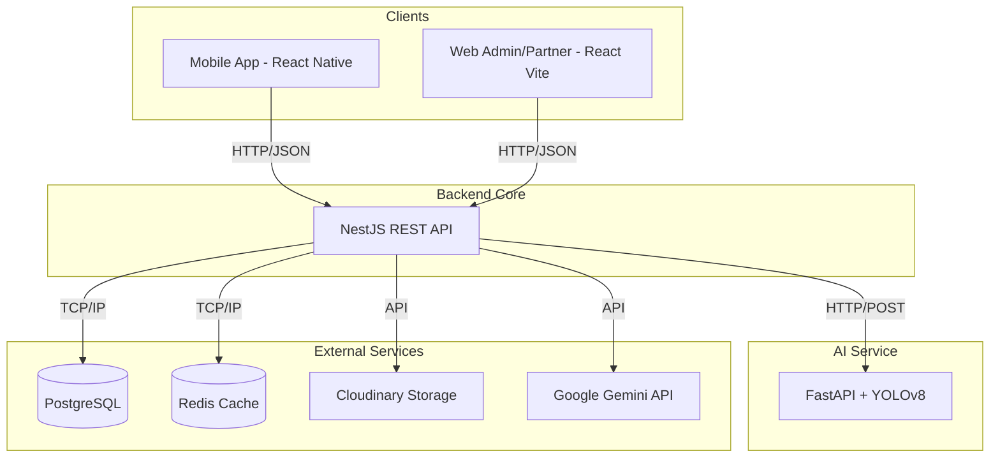
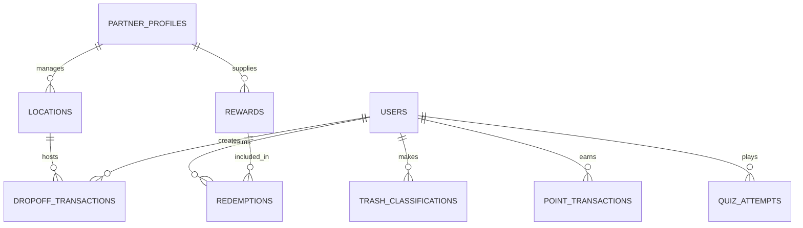

# BÁO CÁO CHI TIẾT DỰ ÁN ECOHABIT
**Hệ thống hỗ trợ phân loại rác bằng AI và khuyến khích hành vi sống xanh**

---

## MỤC LỤC
1. [Chương 1: Mở đầu](#chương-1-mở-đầu)
2. [Chương 2: Cơ sở lý thuyết](#chương-2-cơ-sở-lý-thuyết)
3. [Chương 3: Phân tích yêu cầu hệ thống](#chương-3-phân-tích-yêu-cầu-hệ-thống)
4. [Chương 4: Thiết kế hệ thống](#chương-4-thiết-kế-hệ-thống)
5. [Chương 5: Cài đặt và triển khai](#chương-5-cài-đặt-và-triển-khai)
6. [Chương 6: Kiểm thử và đánh giá](#chương-6-kiểm-thử-và-đánh-giá)
7. [Chương 7: Kết luận và hướng phát triển](#chương-7-kết-luận-và-hướng-phát-triển)

---

## CHƯƠNG 1: MỞ ĐẦU

### 1.1 Lý do chọn đề tài
Trong bối cảnh biến đổi khí hậu và ô nhiễm môi trường đang trở thành vấn đề toàn cầu, việc xử lý rác thải hiệu quả là một trong những thách thức lớn nhất. Một trong những nguyên nhân chính dẫn đến việc xử lý rác thải kém hiệu quả là sự thiếu nhận thức và thói quen phân loại rác tại nguồn của người dân. Người dùng thường gặp khó khăn trong việc xác định loại rác và cách xử lý đúng. Đồng thời, việc thiếu đi các động lực thiết thực khiến quá trình này khó trở thành một thói quen bền vững. 
Dự án **EcoHabit** ra đời nhằm giải quyết vấn đề này bằng cách kết hợp công nghệ Trí tuệ nhân tạo (AI) để hỗ trợ phân loại rác tự động thông qua hình ảnh, đồng thời áp dụng mô hình Gamification (trò chơi hóa) để thưởng điểm và đổi quà, tạo động lực mạnh mẽ cho người dùng hình thành thói quen sống xanh.

### 1.2 Mục tiêu đề tài
Mục tiêu chính của đề tài là xây dựng một hệ thống công nghệ thông tin toàn diện, bao gồm ứng dụng di động cho người dùng cuối và nền tảng quản trị web, với các mục tiêu cụ thể:
- Phát triển mô hình AI có khả năng nhận diện và phân loại rác thải có độ chính xác cao.
- Xây dựng ứng dụng di động (Mobile App) thân thiện, giúp người dùng dễ dàng quét rác, tìm kiếm điểm thu gom, làm bài trắc nghiệm kiến thức (quiz) và tham gia đổi quà.
- Cung cấp nền tảng quản trị (Web Admin và Web Partner) cho phép đối tác quản lý điểm thu gom, phần thưởng và ban quản trị kiểm soát toàn bộ hoạt động của hệ thống.
- Thúc đẩy hành vi bảo vệ môi trường thông qua cơ chế tích lũy điểm thưởng minh bạch và hấp dẫn.

### 1.3 Đối tượng và phạm vi nghiên cứu
- **Đối tượng nghiên cứu:** Các thuật toán học sâu (Deep Learning) trong nhận diện hình ảnh (đặc biệt là YOLOv8), mô hình hành vi người dùng trong Gamification, và các công nghệ phát triển web/mobile hiện đại.
- **Phạm vi ứng dụng:** Ứng dụng tập trung vào người dùng cá nhân có nhu cầu phân loại rác sinh hoạt hằng ngày và các đối tác (cửa hàng, trạm thu gom) muốn tham gia mạng lưới đổi rác lấy quà. Quản trị viên hệ thống sẽ kiểm soát người dùng và đối tác tại Việt Nam.

### 1.4 Phương pháp thực hiện
- **Nghiên cứu tài liệu:** Thu thập lý thuyết về AI, Gamification, và các tài liệu kỹ thuật liên quan đến công nghệ sử dụng.
- **Phân tích và thiết kế:** Xây dựng biểu đồ Use Case, ERD, Sequence Diagram để làm rõ luồng nghiệp vụ.
- **Phát triển phần mềm:** Sử dụng mô hình Agile/Scrum, chia nhỏ các tính năng thành các sprint. Áp dụng kiến trúc Microservices cơ bản với Backend NestJS và AI Service độc lập.
- **Kiểm thử và đánh giá:** Thực hiện Unit Test, Integration Test và User Acceptance Testing (UAT) để đảm bảo chất lượng hệ thống trước khi triển khai.

### 1.5 Ý nghĩa thực tiễn của hệ thống EcoHabit
Hệ thống EcoHabit không chỉ là một công cụ công nghệ mà còn là một giải pháp xã hội. Nó giúp nâng cao nhận thức cộng đồng, giảm tải cho các bãi rác và nhà máy xử lý rác, đồng thời tạo ra một hệ sinh thái kinh tế tuần hoàn nơi rác thải được xem như một nguồn tài nguyên có thể quy đổi thành giá trị thực tế (phần thưởng).

---

## CHƯƠNG 2: CƠ SỞ LÝ THUYẾT

### 2.1 Rác thải và phân loại rác tại nguồn
Phân loại rác tại nguồn là quá trình tách biệt các loại rác thải ngay tại nơi phát sinh (hộ gia đình, trường học, cơ quan) thành các nhóm khác nhau (rác hữu cơ, rác tái chế, rác vô cơ). Việc này giúp tối ưu hóa quá trình tái chế, giảm diện tích chôn lấp và hạn chế ô nhiễm môi trường.

### 2.2 Trí tuệ nhân tạo trong nhận diện ảnh và YOLOv8
Nhận diện hình ảnh (Image Recognition) và Phát hiện đối tượng (Object Detection) là các bài toán cốt lõi của Computer Vision. Trong dự án này, mô hình **YOLOv8** (You Only Look Once version 8) được sử dụng. YOLOv8 nổi bật với khả năng phát hiện đối tượng theo thời gian thực với độ chính xác cao và tốc độ xử lý nhanh, rất phù hợp để triển khai dưới dạng API cho các ứng dụng di động nơi yêu cầu độ trễ thấp.

### 2.3 Công nghệ Backend
- **FastAPI:** Một web framework hiện đại, hiệu suất cao dùng để xây dựng API với Python, được lựa chọn để bọc mô hình YOLOv8 thành một dịch vụ AI độc lập (AI Service).
- **NestJS:** Framework Node.js kiến trúc module hóa, hỗ trợ TypeScript mạnh mẽ, sử dụng làm Backend cốt lõi xử lý logic nghiệp vụ, xác thực và quản lý cơ sở dữ liệu.
- **PostgreSQL:** Hệ quản trị cơ sở dữ liệu quan hệ mạnh mẽ, đảm bảo tính toàn vẹn dữ liệu cho các giao dịch điểm thưởng và thông tin người dùng.
- **Redis:** In-memory data structure store, dùng để lưu trữ cache, quản lý trạng thái OTP và session quiz hằng ngày, giúp tăng tốc độ phản hồi.
- **Cloudinary:** Dịch vụ lưu trữ hình ảnh trên cloud, tối ưu hóa việc upload và quản lý ảnh rác do người dùng chụp.

### 2.4 Công nghệ Frontend
- **React Native & Expo:** Framework đa nền tảng giúp phát triển Mobile App cho cả iOS và Android với một codebase duy nhất bằng TypeScript. Expo giúp đơn giản hóa quá trình build và test ứng dụng.
- **React & Vite:** Sự kết hợp hoàn hảo cho Web Admin và Web Partner. Vite mang lại tốc độ khởi tạo và hot-reload cực nhanh, trong khi React đảm bảo tính linh hoạt trong việc xây dựng các UI component phức tạp.

### 2.5 Gamification và Hành vi sống xanh
Gamification (Trò chơi hóa) là việc ứng dụng các yếu tố thiết kế trò chơi (điểm số, huy hiệu, bảng xếp hạng, phần thưởng) vào ngữ cảnh phi trò chơi. EcoHabit sử dụng Gamification để kích thích hệ thống phần thưởng trong não bộ người dùng, chuyển đổi một công việc nhàm chán (bỏ rác) thành một trải nghiệm thú vị, từ đó hình thành "hành vi thân thiện với môi trường" (pro-environmental behavior) một cách tự nhiên và bền vững.

---

## CHƯƠNG 3: PHÂN TÍCH YÊU CẦU HỆ THỐNG

### 3.1 Tổng quan yêu cầu
Hệ thống EcoHabit phải đáp ứng nhu cầu của 3 nhóm người dùng chính, với quy trình xuyên suốt từ việc định danh rác, mang rác đến điểm thu gom, tích lũy điểm thưởng và cuối cùng là đổi lấy các quà tặng có giá trị.

### 3.2 Tác nhân hệ thống
1. **User (Người dùng cuối):** Những cá nhân sử dụng Mobile App để phân loại rác, làm quiz, tìm kiếm điểm thu gom và đổi quà.
2. **Partner (Đối tác):** Các tổ chức/cá nhân tham gia vào mạng lưới. Được chia làm 3 loại: 
   - *Collection Point Partner:* Cung cấp điểm thu gom rác.
   - *Reward Partner:* Cung cấp phần thưởng.
   - *Hybrid Partner:* Cung cấp cả hai.
3. **Admin (Quản trị viên):** Người vận hành nền tảng, có quyền cao nhất trong Web Admin, quản lý toàn bộ dữ liệu, người dùng, đối tác và các cấu hình hệ thống.

### 3.3 Yêu cầu chức năng cho User
| Mã YC | Tên chức năng | Mô tả chi tiết |
|---|---|---|
| USR_01 | Đăng nhập/Đăng ký | Xác thực bằng email và OTP. Có tính năng khôi phục mật khẩu. |
| USR_02 | Quản lý hồ sơ | Cập nhật thông tin cá nhân, ảnh đại diện. |
| USR_03 | Chụp/Tải ảnh rác (Scan) | Upload hình ảnh rác để AI phân loại. |
| USR_04 | Xem kết quả AI | Hiển thị loại rác, thùng rác phù hợp và hướng dẫn xử lý chi tiết. |
| USR_05 | Phản hồi AI (Feedback) | Đánh giá độ chính xác của AI để cải thiện mô hình. |
| USR_06 | Xem lịch sử phân loại | Liệt kê các lần quét rác trước đó. |
| USR_07 | Tích điểm và Xem ví điểm | Cộng điểm tự động. Hiển thị số dư và lịch sử giao dịch điểm. |
| USR_08 | Làm quiz hằng ngày | Trả lời câu hỏi môi trường để nhận điểm. Giới hạn mỗi ngày 1 bộ câu hỏi. |
| USR_09 | Bản đồ điểm thu gom | Xem vị trí điểm thu gom trên bản đồ, lọc theo loại rác. |
| USR_10 | Check-in thu gom rác | Quét mã QR tại điểm thu gom để xác nhận đã gửi rác thành công. |
| USR_11 | Xem và Đổi phần thưởng | Duyệt danh mục quà tặng, sử dụng điểm để đổi quà. |
| USR_12 | Xem mẹo sống xanh | Xem Daily Tips sinh ra bởi AI (Gemini). |
| USR_13 | Huy hiệu và Bảng xếp hạng | Theo dõi thành tích cá nhân, so sánh hạng với người dùng khác. |

### 3.4 Yêu cầu chức năng cho Partner
| Mã YC | Tên chức năng | Mô tả chi tiết |
|---|---|---|
| PRT_01 | Đăng ký tài khoản Partner | Đăng ký và chờ Admin phê duyệt. |
| PRT_02 | Quản lý hồ sơ doanh nghiệp | Cập nhật tên, địa chỉ, loại hình đối tác. |
| PRT_03 | Quản lý điểm thu gom | Thêm mới, sửa, xóa điểm thu gom rác. Cấu hình loại rác chấp nhận. |
| PRT_04 | Quản lý mã QR thu gom | Sinh mã QR động cho các giao dịch thu gom để User quét. |
| PRT_05 | Quản lý giao dịch thu gom | Xác nhận rác đã nhận từ User, duyệt giao dịch để hệ thống cộng điểm cho User. |
| PRT_06 | Quản lý phần thưởng | Đăng tải, chỉnh sửa, cấp phát số lượng kho quà tặng. |
| PRT_07 | Quản lý lượt đổi quà | Xác nhận và đánh dấu các đơn đổi quà đã được xử lý/giao cho User. |
| PRT_08 | Xem thống kê | Báo cáo số lượng rác thu gom, lượt đổi quà theo thời gian thực. |

### 3.5 Yêu cầu chức năng cho Admin
| Mã YC | Tên chức năng | Mô tả chi tiết |
|---|---|---|
| ADM_01 | Quản lý người dùng | Xem danh sách, khóa/mở khóa tài khoản User. |
| ADM_02 | Quản lý đối tác | Phê duyệt hồ sơ Partner, phân loại quyền Partner. |
| ADM_03 | Quản lý điểm thu gom & Quà | Giám sát toàn bộ điểm thu gom và phần thưởng trên hệ thống. |
| ADM_04 | Quản lý Quiz | Tạo bộ câu hỏi, cấu hình quy tắc quiz. |
| ADM_05 | Quản lý kết quả AI | Xem lịch sử nhận diện của AI và feedback từ người dùng. |
| ADM_06 | Quản lý quy tắc điểm (Rule Engine) | Định nghĩa số điểm thưởng cho từng hành động (VD: quét rác đúng = 10đ, làm quiz = 5đ). |
| ADM_07 | Dashboard thống kê | Tổng quan biểu đồ hệ thống, lượng người dùng tích cực. |
| ADM_08 | Audit & Fraud Logs | Xem nhật ký hoạt động hệ thống và các cảnh báo gian lận (spam quét rác, fake GPS). |

### 3.6 Yêu cầu phi chức năng
- **Hiệu năng:** API phản hồi dưới 500ms đối với các tác vụ thông thường. AI dự đoán dưới 2 giây.
- **Bảo mật:** Sử dụng JWT cho xác thực. Mật khẩu mã hóa bằng bcrypt. Phân quyền chặt chẽ Role-Based Access Control (RBAC).
- **Tính khả dụng:** Hệ thống có khả năng mở rộng (scalable), thiết kế mobile đáp ứng tốt trên đa màn hình.
- **Độ tin cậy:** Giao dịch cộng/trừ điểm sử dụng database transaction để tránh lỗi mất mát dữ liệu.

### 3.7 Biểu đồ Use Case

```mermaid
usecaseDiagram
    actor User
    actor Partner
    actor Admin

    package "EcoHabit System" {
        usecase "Quản lý tài khoản" as UC1
        usecase "Phân loại rác bằng AI" as UC2
        usecase "Tìm điểm thu gom" as UC3
        usecase "Đổi phần thưởng" as UC4
        usecase "Làm Quiz hằng ngày" as UC5
        usecase "Quản lý điểm & Giao dịch" as UC6
        usecase "Quản lý điểm thu gom" as UC7
        usecase "Quản lý danh mục quà" as UC8
        usecase "Quản lý hệ thống & Phê duyệt" as UC9
    }

    User --> UC1
    User --> UC2
    User --> UC3
    User --> UC4
    User --> UC5
    
    Partner --> UC1
    Partner --> UC7
    Partner --> UC8
    Partner --> UC6

    Admin --> UC1
    Admin --> UC9
    Admin --> UC8
    Admin --> UC7
```
*Hình 3.1. Sơ đồ Use Case tổng quát hệ thống EcoHabit.*

---

## CHƯƠNG 4: THIẾT KẾ HỆ THỐNG

### 4.1 Kiến trúc tổng thể

Hệ thống được thiết kế theo mô hình Client-Server phân tán, kết nối qua RESTful API.

*Hình 4.1. Sơ đồ kiến trúc tổng thể hệ thống EcoHabit.*

### 4.2 Thiết kế kiến trúc Mobile App
Mobile App được xây dựng theo kiến trúc Component-based của React Native, tổ chức thư mục bao gồm:
- **Navigation:** Cấu hình Bottom Tabs và Stack Navigator.
- **Screens:** Phân chia theo feature (`auth`, `home`, `map`, `scan`, `wallet`, `rewards`, `quiz`, `profile`).
- **Services:** Chứa Axios instance gọi API, xử lý Token Interceptors.
- **Store:** Quản lý Global State (Zustand hoặc Context API) cho trạng thái đăng nhập.
- **Components:** Các UI element dùng chung (Button, Card, Modal) định dạng bằng TailwindCSS.

### 4.3 Thiết kế kiến trúc Web Admin/Partner
Web App dùng React và Vite, chia layout theo Role (Admin Layout, Partner Layout).
- **Routing:** React Router DOM bảo vệ bằng Private Routes.
- **Data Fetching:** Sử dụng React Query (`@tanstack/react-query`) để cache dữ liệu, tự động đồng bộ API.
- **Features Module:** Chia nhỏ thành các thư mục `admin` (point rules, user list, fraud logs) và `partner` (manage locations, create rewards).

### 4.4 Thiết kế kiến trúc Backend
Backend NestJS tuân thủ triệt để nguyên lý SOLID và kiến trúc Module (Controller - Service - Repository).
- Các Module chính: `auth`, `users`, `ai`, `points`, `rewards`, `locations`, `quiz`, `admin`, `partner`, `fraud`, `audit`, `uploads`, `gemini`.
- **Auth Guard & Role Guard:** Chặn request không có JWT hợp lệ, và kiểm tra trường `role` (USER, ADMIN, PARTNER_COLLECTION, PARTNER_REWARD) trước khi cho phép vào Controller.

### 4.5 Thiết kế AI service
AI Service viết bằng Python (FastAPI).
1. Nhận ảnh định dạng form-data từ NestJS.
2. Tiền xử lý ảnh qua thư viện Pillow/OpenCV (resize, normalize).
3. Đưa qua Model YOLOv8 (`yolov8n-waste-12cls-best.pt`).
4. Trích xuất Bounding Box và Confidence Score cao nhất.
5. Mapping class ID sang chuỗi mô tả (VD: "Chai nhựa", "Vỏ lon").
6. Trả về kết quả JSON cho NestJS lưu vào database.

### 4.6 Thiết kế cơ sở dữ liệu/ERD
Hệ thống sử dụng PostgreSQL thông qua TypeORM. Lược bỏ các entity liên quan đến forum.

**Danh sách các nhóm thực thể chính:**
1. **Users & Partners:** `users`, `partner_profiles`, `partner_role_types`.
2. **AI Classification:** `trash_classifications`, `ai_feedbacks`.
3. **Points:** `point_transactions`, `point_rules`.
4. **Rewards:** `rewards`, `redemptions`, `reward_pickup_options`.
5. **Locations & Dropoff:** `locations`, `accepted_waste_types`, `collection_location_profiles`, `dropoff_transactions`.
6. **Quiz:** `daily_quiz_sets`, `quiz_questions`, `quiz_options`, `quiz_attempts`, `quiz_attempt_answers`.
7. **System & Audit:** `admin_audit_logs`, `fraud_flags`, `badges`, `user_badges`.


*Hình 4.2. Trích xuất sơ đồ ERD cốt lõi kết nối giữa User, Partner và các hoạt động.*

### 4.7 Thiết kế API (RESTful)
API được thiết kế chuẩn REST, tiền tố `/api`. Bọc bằng Swagger.
- `POST /api/auth/login`: Xác thực.
- `POST /api/ai/classify`: Phân loại ảnh.
- `GET /api/points/balance`: Xem điểm.
- `GET /api/locations`: Tra cứu bản đồ.
- `POST /api/rewards/redeem`: Đổi quà.

### 4.8 Thiết kế rule engine cho điểm
Để hệ thống linh hoạt, điểm thưởng không hardcode mà được định nghĩa trong bảng `point_rules`. 
Admin có thể cấu hình: 
- `ACTION_SCAN_TRASH`: 10 điểm / lần.
- `ACTION_DAILY_QUIZ`: 20 điểm / lần hoàn thành.
- Hệ thống lắng nghe sự kiện (Event Emitter), khi một hành động hoàn thành sẽ tự động cộng điểm theo cấu hình rule tương ứng, đồng thời ghi vào `point_transactions` để truy vết.

### 4.9 Thiết kế phân quyền
- `USER`: Chỉ thao tác trên dữ liệu cá nhân của mình (id trong token trùng id resource).
- `PARTNER`: Thao tác trên các tài nguyên thuộc sở hữu của Partner (Locations, Rewards do họ tạo).
- `ADMIN`: Full access toàn hệ thống.

### 4.10 Thiết kế bảo mật
- **Bảo mật API:** Sử dụng Passport JWT, thiết lập thời hạn sống của token, chống Replay Attack.
- **Quản lý file:** Upload ảnh lên Cloudinary thay vì lưu ổ cứng local, giảm rủi ro tấn công qua file thực thi.
- **Chống gian lận (Fraud Detection):** Bảng `fraud_flags` tự động ghi nhận nếu User thực hiện quét rác liên tục trong thời gian ngắn hoặc check-in điểm thu gom không hợp lý.

---

## CHƯƠNG 5: CÀI ĐẶT VÀ TRIỂN KHAI

### 5.1 Môi trường cài đặt
- **OS:** Windows / Linux.
- **Runtime:** Node.js v18+, Python 3.10+.
- **Database:** PostgreSQL v14, Redis v6+.
- **Công cụ:** Expo CLI, Git, VS Code.

### 5.2 Cấu trúc thư mục & Cách chạy từng Service
Hệ thống gồm 4 component độc lập.

**1. AI Service (FastAPI):**
- Di chuyển vào `ai-service`, tạo Virtual Environment và cài đặt `requirements.txt`.
- Chạy: `uvicorn main:app --host 0.0.0.0 --port 8000 --reload`
- Service lắng nghe tại cổng 8000.

**2. Backend (NestJS):**
- Cài đặt dependency: `npm install`.
- Thiết lập file `.env` chứa `DB_HOST`, `JWT_SECRET`, `CLOUDINARY_API_KEY`, `AI_SERVICE_URL=http://localhost:8000`.
- Chạy migration/seed: Sử dụng `seed_data.sql` và `seed-test-location.js` để tạo dữ liệu giả lập.
- Chạy: `npm run start:dev`. Server lắng nghe tại cổng 3000.

**3. Web Admin/Partner (React/Vite):**
- Di chuyển vào thư mục `web`, `npm install`.
- Cấu hình file `.env` trỏ API về `localhost:3000/api`.
- Chạy: `npm run dev`. Trình duyệt mở tại cổng 5173.

**4. Mobile App (Expo):**
- Di chuyển vào `mobile`, `npm install`.
- Thay đổi địa chỉ IP của backend trong API client do thiết bị di động cần kết nối IP LAN.
- Chạy: `npx expo start`. Sử dụng Expo Go trên điện thoại quét mã QR để mở app.

### 5.3 Mô tả một số màn hình chức năng đã cài đặt
- **Màn hình Scan (Mobile):** Cung cấp UI bật camera, chụp ảnh và hiện màn hình loading dạng radar, sau đó trả về thẻ kết quả (Tên rác, Cách xử lý, Số điểm nhận được).
- **Màn hình Map (Mobile):** Tích hợp bản đồ hiển thị marker của các trạm thu gom.
- **Admin Dashboard (Web):** Bảng điều khiển quản lý quy tắc cộng điểm (AdminPointRuleDrawer), xem danh sách người dùng và các biểu đồ đổi quà.

---

## CHƯƠNG 6: KIỂM THỬ VÀ ĐÁNH GIÁ

### 6.1 Kiểm thử chức năng và API
Sử dụng Swagger UI và Postman để kiểm thử từng endpoint.
- **Auth API:** Xác minh OTP được gửi thành công qua Nodemailer, Token JWT sinh ra đúng chuẩn và giải mã thành công.
- **User API:** Đảm bảo mã hóa mật khẩu và cập nhật profile chuẩn xác.

### 6.2 Kiểm thử các luồng chính
- **Luồng Phân loại rác:**
  1. User chụp chai nhựa.
  2. Mobile gọi POST `/api/ai/classify`.
  3. NestJS forward ảnh sang FastAPI.
  4. YOLOv8 nhận diện "Plastic bottle" với confidence 0.95.
  5. NestJS ghi nhận vào `trash_classifications`, cộng điểm cho User và trả kết quả về Mobile.
  *Kết quả: Luồng hoạt động mượt mà, tổng độ trễ trung bình < 1.5s.*

- **Luồng Tích điểm & Đổi quà:**
  1. Kiểm tra Point Transaction đảm bảo điểm không bị trừ âm.
  2. Test chức năng Redemptions trừ điểm trong ví và sinh ra mã QR cho đơn đổi quà.

- **Luồng Quiz:**
  1. Redis cache trạng thái hoàn thành quiz trong ngày của User.
  2. Tránh việc 1 User lấy điểm Quiz nhiều lần trong cùng 1 ngày.

### 6.3 Kiểm thử phân quyền
Kiểm thử ranh giới truy cập. Đăng nhập bằng tài khoản `USER` cố gắng gọi API `POST /api/point-rules` (thuộc về Admin). Kết quả hệ thống trả về mã lỗi `403 Forbidden` do Role Guard hoạt động chính xác.

### 6.4 Đánh giá ưu điểm, hạn chế
- **Ưu điểm:** Hệ thống hoạt động ổn định, kiến trúc rõ ràng, dễ bảo trì. AI phản hồi nhanh chóng nhờ FastAPI. Trải nghiệm người dùng được tối ưu qua thiết kế Gamification.
- **Hạn chế:** YOLOv8 vẫn có thể nhận diện sai với các hình ảnh quá mờ hoặc rác bị đè nén. Bản đồ hiện tại đang sử dụng fallback data trong một số trường hợp thiếu API key bản đồ thực tế.

---

## CHƯƠNG 7: KẾT LUẬN VÀ HƯỚNG PHÁT TRIỂN

### 7.1 Kết quả đạt được
Đề tài đã hoàn thành xuất sắc việc xây dựng một hệ thống phân loại rác thông minh tích hợp Gamification từ A đến Z, bao gồm đầy đủ Mobile App, Web Admin, Backend API và AI Service. Các quy trình cốt lõi (nhận diện ảnh, check-in, đổi quà) đều chạy thực tế trên code và liên kết chặt chẽ với cơ sở dữ liệu PostgreSQL.

### 7.2 Hạn chế còn tồn tại
- Dữ liệu tập train YOLOv8 (12 class rác) vẫn cần được làm phong phú hơn để cải thiện độ chính xác thực tế tại Việt Nam.
- Quản trị viên chưa có công cụ real-time (như WebSocket) để nhận cảnh báo ngay lập tức khi phát hiện gian lận.

### 7.3 Hướng phát triển tương lai
- **Cải thiện mô hình AI:** Thu thập thêm hàng ngàn mẫu ảnh rác thải đa dạng từ cộng đồng, cho phép AI liên tục tự học (active learning) từ feedback của người dùng.
- **Mở rộng hệ sinh thái phần thưởng:** Liên kết với nhiều thương hiệu, nhãn hàng lớn (F&B, thời trang xanh) để cung cấp các voucher chất lượng cao.
- **Tối ưu hiệu năng:** Triển khai Backend bằng Docker và Kubernetes để đảm bảo tính chịu tải cao (High Availability) khi lượng người dùng tăng vọt.
- **Hoàn thiện Web Partner:** Xây dựng luồng đăng ký trực tiếp và onboarding cho các điểm thu gom tự phát ở địa phương tham gia nền tảng một cách dễ dàng nhất.

---
*Báo cáo kết thúc.*
