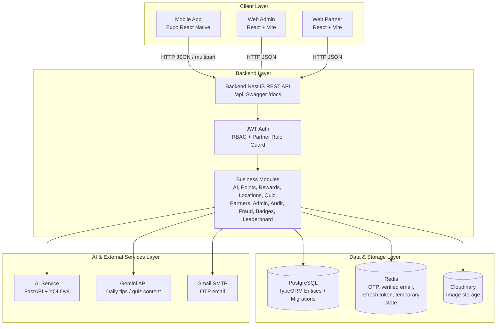
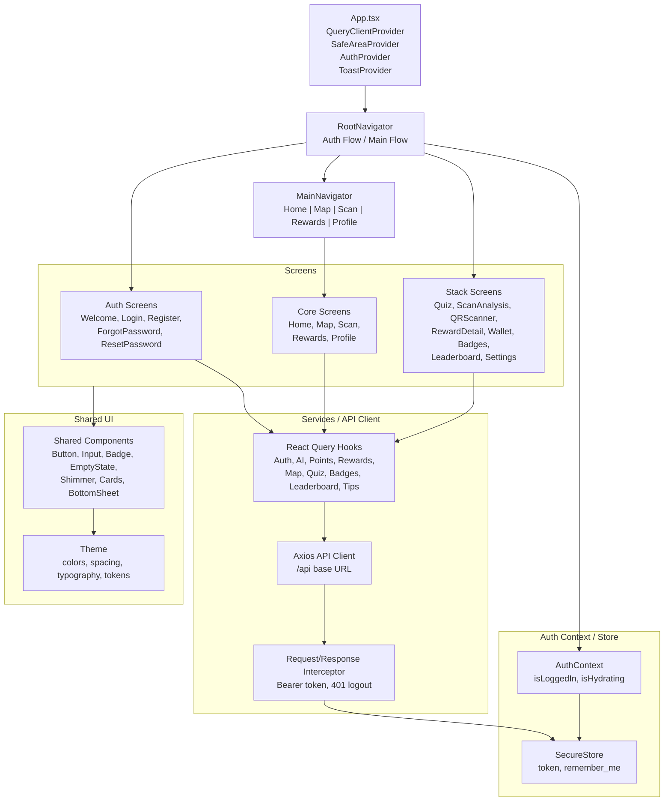
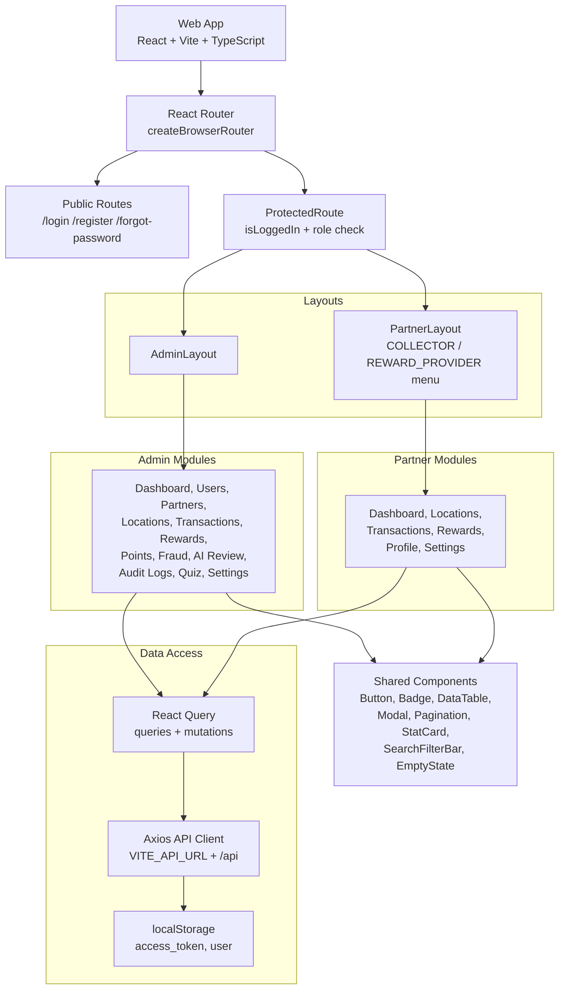
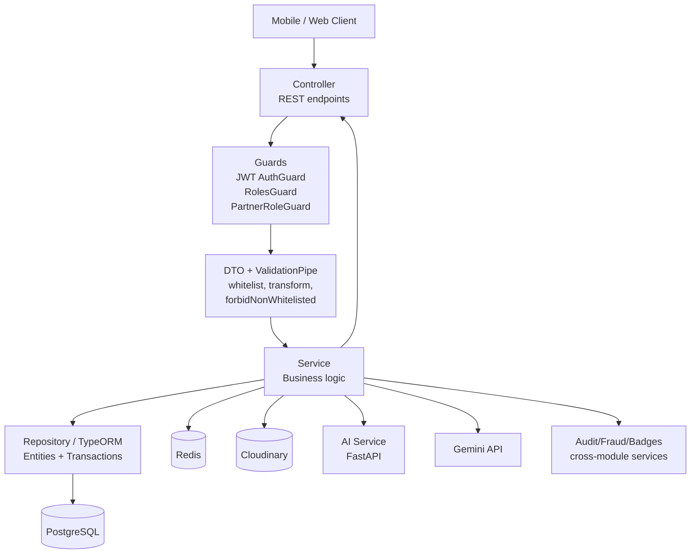
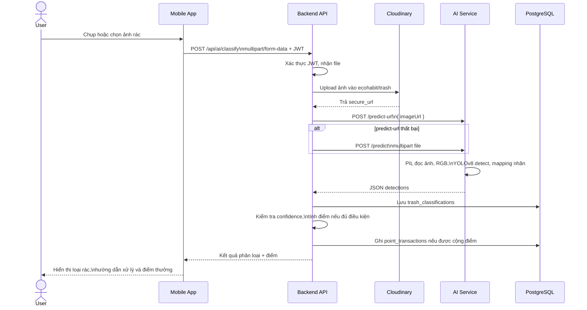
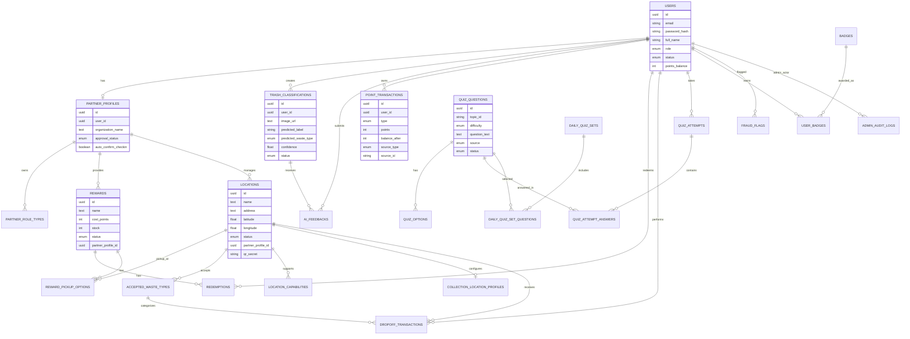
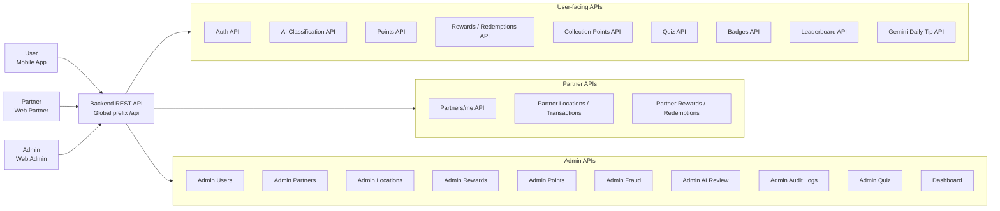
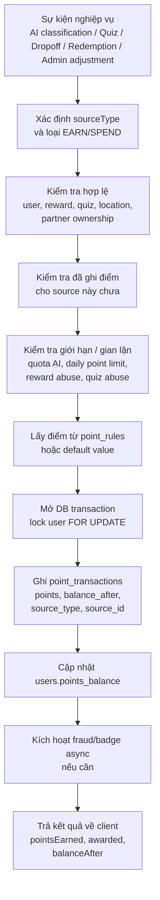
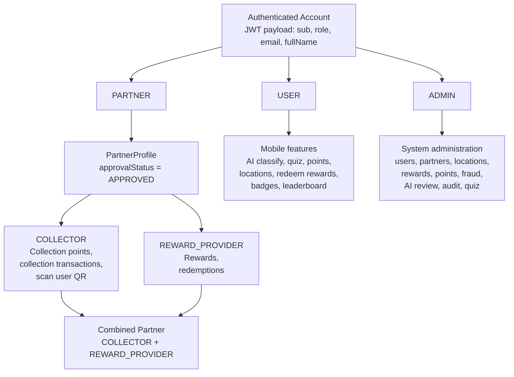
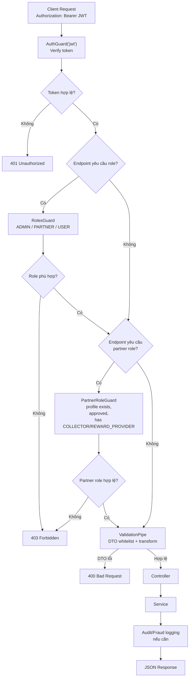

# CHƯƠNG 4. THIẾT KẾ HỆ THỐNG

Chương này trình bày thiết kế hệ thống EcoHabit dựa trên mã nguồn thực tế trong workspace. Nội dung tập trung vào các thành phần đang được triển khai gồm ứng dụng di động, cổng Web Admin/Web Partner, Backend REST API, cơ sở dữ liệu PostgreSQL, Redis, Cloudinary, AI Service FastAPI kết hợp YOLOv8 và tích hợp Gemini API. Các mô tả trong chương ưu tiên hiện trạng mã nguồn hơn README khi hai nguồn có khác biệt và chỉ trình bày những nhóm chức năng thuộc phạm vi báo cáo đã xác định.

## 4.1. Kiến trúc tổng thể

Hệ thống EcoHabit được thiết kế theo kiến trúc nhiều tầng, trong đó mỗi tầng đảm nhiệm một nhóm trách nhiệm riêng. Cách tổ chức này giúp tách biệt giao diện người dùng, xử lý nghiệp vụ, lưu trữ dữ liệu và các dịch vụ trí tuệ nhân tạo. Ở tầng ngoài cùng là các client gồm Mobile App cho người dùng cuối, Web Admin cho quản trị viên và Web Partner cho đối tác. Các client không truy cập trực tiếp cơ sở dữ liệu mà giao tiếp với Backend thông qua REST API. Backend đóng vai trò trung tâm điều phối nghiệp vụ, kiểm tra xác thực, phân quyền, validate dữ liệu, gọi các dịch vụ bên ngoài và lưu kết quả vào cơ sở dữ liệu.

Tầng Client Layer gồm ba ứng dụng chính. Mobile App được xây dựng bằng Expo React Native và TypeScript, phục vụ các tác vụ của người dùng cuối như đăng ký, đăng nhập, phân loại rác bằng ảnh, làm quiz, tra cứu điểm thu gom, check-in, xem ví điểm, đổi quà, xem huy hiệu và bảng xếp hạng. Web Admin được xây dựng bằng React, Vite và TypeScript, phục vụ quản trị toàn hệ thống như quản lý người dùng, đối tác, điểm thu gom, giao dịch, phần thưởng, điểm, kiểm duyệt AI, gian lận, nhật ký quản trị và quiz. Web Partner cũng dùng chung nền tảng React/Vite, nhưng giao diện và quyền được giới hạn cho đối tác quản lý điểm thu gom, giao dịch thu gom, phần thưởng hoặc lượt đổi quà liên quan đến đơn vị của mình.

Backend Layer là ứng dụng NestJS REST API. Backend được tổ chức theo module nghiệp vụ, mỗi module thường gồm controller, service, DTO, entity và repository thông qua TypeORM. Backend chịu trách nhiệm xác thực JWT, xử lý OTP qua email, phân quyền theo vai trò, kiểm tra quyền nghiệp vụ của partner, điều phối luồng phân loại rác qua AI Service, tính điểm thưởng, ghi nhận giao dịch điểm, quản lý đổi quà, quiz, huy hiệu, bảng xếp hạng, thống kê và audit log.

Data & Storage Layer gồm PostgreSQL, Redis và Cloudinary. PostgreSQL là nơi lưu trữ dữ liệu bền vững như người dùng, hồ sơ đối tác, lịch sử phân loại rác, điểm thưởng, phần thưởng, điểm thu gom, quiz, huy hiệu, cờ gian lận và nhật ký quản trị. Redis được sử dụng cho dữ liệu tạm thời như OTP, trạng thái xác minh email, refresh token và một số kiểm soát ngắn hạn. Cloudinary dùng để lưu ảnh do người dùng tải lên khi phân loại rác hoặc ảnh minh họa liên quan đến phần thưởng.

AI & External Services Layer gồm AI Service FastAPI + YOLOv8 và Gemini API. AI Service nhận ảnh hoặc URL ảnh, xử lý bằng PIL, đưa qua mô hình YOLOv8, sau đó chuẩn hóa nhãn thành loại rác, thùng rác gợi ý và hướng dẫn xử lý. Gemini API được Backend sử dụng cho các nội dung AI như gợi ý mẹo sống xanh và hỗ trợ sinh nội dung quiz khi có cấu hình khóa API phù hợp.

Luồng giao tiếp tổng quát của hệ thống là: Mobile/Web gửi request đến Backend REST API; Backend xác thực, phân quyền, validate dữ liệu và gọi PostgreSQL/Redis/Cloudinary hoặc AI Service/Gemini tùy nghiệp vụ; sau đó Backend trả response dạng JSON về client. Với cách thiết kế này, từng thành phần có thể nâng cấp độc lập. Ví dụ có thể thay đổi model YOLO trong AI Service mà không cần viết lại Mobile App; có thể mở rộng Web Admin mà không ảnh hưởng đến API của Mobile; hoặc có thể tối ưu PostgreSQL/Redis mà vẫn giữ nguyên hợp đồng REST API.

**Hình 4.1. Sơ đồ kiến trúc tổng thể hệ thống EcoHabit**

Mô tả sơ đồ: Hình 4.1 thể hiện kiến trúc nhiều tầng của EcoHabit. Các ứng dụng client chỉ giao tiếp với Backend thông qua REST API. Backend là trung tâm xử lý nghiệp vụ và kết nối đến các lớp lưu trữ, AI Service, Gemini API và dịch vụ gửi email. Cách thiết kế này giúp hệ thống có tính mô-đun, dễ bảo trì và có khả năng mở rộng từng thành phần độc lập.

## 4.2. Thiết kế kiến trúc Mobile App

Mobile App của EcoHabit được xây dựng bằng Expo React Native, TypeScript, React Navigation, React Query, Axios, NativeWind, React Native Paper và các thư viện Expo như camera, image picker, location, secure store. Ứng dụng phục vụ người dùng cuối nên thiết kế tập trung vào các luồng thao tác nhanh: đăng nhập, quét/phân loại rác, xem điểm, làm quiz, tra cứu bản đồ điểm thu gom, check-in, đổi quà và theo dõi tiến trình gamification.

Cấu trúc mã nguồn Mobile App được chia theo các nhóm chính trong thư mục `mobile/src`: `navigation`, `screens`, `services`, `store`, `context`, `components` và `theme`. Nhóm `navigation` định nghĩa luồng điều hướng chính. Nhóm `screens` chứa các màn hình nghiệp vụ. Nhóm `services` chứa các hook React Query và API client để gọi Backend. Nhóm `store` và `context` quản lý trạng thái xác thực, token và toast. Nhóm `components` chứa các thành phần dùng lại như button, input, badge, shimmer, bottom sheet, card và layout hồ sơ. Nhóm `theme` định nghĩa màu sắc, spacing, typography và token giao diện.

Về điều hướng, `RootNavigator` kiểm tra trạng thái đăng nhập từ `AuthContext`. Khi ứng dụng đang hydrate trạng thái, giao diện hiển thị loading. Nếu chưa đăng nhập, người dùng đi qua Auth Flow gồm Welcome, Login, Register, Forgot Password và Reset Password. Nếu đã đăng nhập, ứng dụng hiển thị `MainNavigator` với bottom tabs gồm Home, Map, Scan, Rewards và Profile. Ngoài các tab chính, stack còn chứa nhiều màn hình phụ như QuizIntro, QuizPlay, QuizResult, QRScanner, ScanAnalysis, RewardDetail, Wallet, Badges, Leaderboard và các màn hình cài đặt hồ sơ.

Nhóm màn hình xác thực cho phép người dùng đăng ký, xác minh OTP, đăng nhập và khôi phục mật khẩu. Nhóm trang chủ tổng hợp thông tin điểm, mẹo sống xanh, hoạt động gần đây và các lối tắt tới quiz hoặc tính năng khác. Nhóm phân loại rác gồm màn hình chọn/chụp ảnh và màn hình phân tích kết quả. Nhóm bản đồ/điểm thu gom sử dụng vị trí người dùng, gọi API điểm thu gom và hỗ trợ tìm địa chỉ. Nhóm quiz cho phép lấy quiz hằng ngày, trả lời câu hỏi và xem kết quả. Nhóm điểm thưởng/ví điểm hiển thị số dư và lịch sử giao dịch điểm. Nhóm đổi quà hiển thị danh sách quà, chi tiết quà và thao tác redeem. Nhóm hồ sơ/cài đặt/huy hiệu/bảng xếp hạng cho phép người dùng xem thông tin cá nhân, thay đổi cài đặt, xem huy hiệu đạt được và thứ hạng.

Tầng services/API client của mobile được tổ chức theo module nghiệp vụ. `mobile/src/services/api/api.ts` tạo axios instance với base URL dạng `http://<expo-host-ip>:3000/api`, trong đó IP được lấy từ `expo-constants`. `mobile/src/services/api/interceptor.ts` gắn Bearer token vào request bằng token lấy từ SecureStore. Khi response trả về 401, interceptor gọi logout để xóa token cũ. Các service nghiệp vụ gồm auth service, AI service, points service, rewards service, map/location service, quiz service, badges service, leaderboard service và tips service. Các service này thường được đóng gói thành hook React Query như `useLogin`, `useClassifyWaste`, `useGetDailyQuiz`, `useSubmitDailyQuiz`, `useGetAllRewards`, `useRedeemReward`, `useGetPointHistory`, `useGetMyBadges` và `useGetLeaderboard`.

Trạng thái xác thực được quản lý bởi `AuthContext` kết hợp với `mobile/src/store/auth.store.ts`. Token được lưu bằng `expo-secure-store` dưới khóa `token`; trạng thái "remember me" được lưu dưới khóa `remember_me`. Khi mở app, `AuthProvider` gọi `clearSessionIfNotRemembered`. Nếu người dùng không chọn ghi nhớ đăng nhập, token bị xóa và app điều hướng về Auth Flow. Nếu còn token hợp lệ, app chuyển vào Main Tabs. Cơ chế này giúp mobile không phải truyền token thủ công tại từng request, đồng thời tách rõ trạng thái UI đăng nhập và dữ liệu token lưu trữ.

Luồng scan và hiển thị kết quả AI là một luồng nghiệp vụ quan trọng của Mobile App. Người dùng chụp ảnh hoặc chọn ảnh từ thư viện. Mobile tạo form-data từ URI ảnh và gửi đến endpoint `/api/ai/classify` với header `multipart/form-data`. Backend nhận file, upload ảnh lên Cloudinary, gọi AI Service để dự đoán loại rác, lưu kết quả vào database và tính điểm nếu confidence đủ ngưỡng. Mobile nhận response gồm `classificationId`, `imageUrl`, `label`, `displayLabel`, `confidence`, `wasteType`, `suggestedBin`, `instruction`, `pointsEarned`, `awarded`, `balanceAfter` và trạng thái cần kiểm duyệt nếu có. Sau đó màn hình Scan Analysis hiển thị loại rác, hướng dẫn xử lý, điểm nhận được và các thông tin liên quan.

Các luồng khác cũng được thiết kế theo cùng nguyên tắc client gọi Backend qua service hook. Với quiz, mobile gọi `/api/quiz/daily` để lấy bộ câu hỏi hằng ngày, sau đó gửi đáp án qua `/api/quiz/daily/submit` hoặc `/api/quiz/daily/:topicId/submit`. Với check-in điểm thu gom, người dùng hoặc partner quét QR tùy ngữ cảnh; Backend xác thực token QR, kiểm tra quyền partner và ghi nhận `dropoff_transactions`. Với đổi quà, mobile lấy danh sách quà qua `/api/rewards`, xem chi tiết và gửi yêu cầu đổi qua `/api/redemptions`. Với huy hiệu và bảng xếp hạng, mobile gọi các API `badges` và `leaderboard` để hiển thị tiến trình gamification.

**Hình 4.2. Sơ đồ kiến trúc Mobile App**

Mô tả sơ đồ: Hình 4.2 mô tả cách Mobile App được chia thành điều hướng, màn hình, service/API client, trạng thái xác thực và giao diện dùng chung. Điểm quan trọng là các màn hình không gọi HTTP rời rạc mà thông qua service hook và axios client có interceptor, giúp thống nhất xử lý token và lỗi xác thực.

## 4.3. Thiết kế kiến trúc Web Admin/Partner

Web Admin/Web Partner được xây dựng bằng React, Vite, TypeScript, React Router, React Query, Axios, lucide-react, sonner, zod và các thành phần giao diện dùng chung. Không giống thông tin cũ trong README, thư mục `web/` hiện có source code đầy đủ cho portal quản trị và portal đối tác. Ứng dụng web được triển khai như một single-page application, trong đó routing và phân quyền giao diện được khai báo tập trung trong `web/src/app/router.tsx`.

Router định nghĩa các route public gồm `/login`, `/register`, `/forgot-password` và route bảo vệ cho `/admin`, `/partner`. `ProtectedRoute` kiểm tra `isLoggedIn` từ AuthProvider, sau đó kiểm tra role lưu trong localStorage. Nếu người dùng chưa đăng nhập, route chuyển về `/login`. Nếu người dùng đã đăng nhập nhưng role không phù hợp, route chuyển về trang tương ứng hoặc `/unauthorized`. Role chính của web là `ADMIN` và `PARTNER`. Admin được điều hướng về `/admin`, Partner được điều hướng về `/partner`.

Layout được tách thành `AdminLayout` và `PartnerLayout`. `AdminLayout` cung cấp khung giao diện quản trị toàn hệ thống, thường bao gồm sidebar, navigation, phần nội dung và các liên kết module quản trị. `PartnerLayout` cung cấp khung giao diện cho đối tác; layout này còn xét role nghiệp vụ của partner như `COLLECTOR` và `REWARD_PROVIDER` để hiển thị chức năng phù hợp. Ví dụ partner có vai trò thu gom được truy cập nhóm quản lý điểm thu gom và giao dịch thu gom, còn partner cung cấp quà được truy cập nhóm phần thưởng và lượt đổi quà.

Tầng service của web gồm axios API client và các hook React Query. `web/src/shared/services/api-client.ts` tạo axios instance với base URL lấy từ `VITE_API_URL`, mặc định là `http://localhost:3000`, sau đó nối global prefix `/api`. Request interceptor tự gắn `Authorization: Bearer <token>` từ `localStorage`. Response interceptor xử lý 401 bằng cách xóa token, xóa user và chuyển về `/login`. Các module nghiệp vụ trong `web/src/features` thường có `services/api.ts`, `services/queries.ts`, `services/mutations.ts` hoặc các hook cụ thể như `use-get-rewards`, `use-create-reward`, `use-verify-transaction`. Cách tổ chức này giúp mỗi module có lớp truy cập dữ liệu riêng nhưng vẫn dùng chung API client.

Các components dùng chung trong `web/src/shared/components` gồm Button, Badge, DataTable, Modal, Pagination, LoadingState, EmptyState, StatCard, SearchFilterBar và IconButton. Các component này giúp giao diện admin/partner có phong cách nhất quán, đồng thời giảm lặp mã ở các trang có bảng dữ liệu, bộ lọc, phân trang và modal chi tiết.

Module Admin hiện bao gồm Dashboard, Users, Partners, Locations, Transactions, Rewards, Points, Fraud, AI Review, Audit Logs, Quiz và Settings. Admin Dashboard lấy số liệu tổng quan. Users quản lý danh sách người dùng, trạng thái tài khoản, chi tiết hoạt động, điểm, đổi quà, dropoff và lịch sử AI. Partners quản lý hồ sơ đối tác, phê duyệt, role và trạng thái tài khoản. Locations quản lý điểm thu gom. Transactions theo dõi giao dịch thu gom. Rewards quản lý phần thưởng và trạng thái. Points quản lý giao dịch điểm và rule điểm. Fraud phục vụ theo dõi và xử lý cờ gian lận. AI Review phục vụ kiểm duyệt kết quả phân loại AI. Audit Logs hiển thị nhật ký thao tác quản trị. Quiz quản lý ngân hàng câu hỏi, import/generate câu hỏi, snapshot và attempt. Settings hiện có phần thông số vận hành dạng cấu hình giao diện.

Module Partner gồm Dashboard, Locations, Transactions, Rewards, Profile và Settings. Partner chỉ nhìn thấy và thao tác trên dữ liệu liên quan đến đơn vị của mình. Partner thu gom có thể quản lý điểm thu gom và giao dịch thu gom. Partner cung cấp quà có thể quản lý phần thưởng và lượt đổi quà. Partner kết hợp có cả hai nhóm chức năng nếu hồ sơ partner có cả `COLLECTOR` và `REWARD_PROVIDER`.

**Hình 4.3. Sơ đồ kiến trúc Web Admin/Partner**

Mô tả sơ đồ: Hình 4.3 cho thấy web portal dùng router tập trung để phân tách route public và route bảo vệ. AdminLayout phục vụ quản trị toàn hệ thống, PartnerLayout phục vụ đối tác theo quyền nghiệp vụ. Các trang không gọi API trực tiếp mà đi qua React Query và axios API client dùng chung.

## 4.4. Thiết kế kiến trúc Backend

Backend EcoHabit được xây dựng bằng NestJS và TypeScript theo kiến trúc module. Ứng dụng khởi tạo trong `backend/src/main.ts`, bật global prefix `/api`, enable CORS, cấu hình global `ValidationPipe`, serve static assets trong thư mục uploads và cấu hình Swagger tại `/docs`. `AppModule` là module gốc, import `ConfigModule`, `TypeOrmModule` và các module nghiệp vụ. TypeORM kết nối PostgreSQL bằng biến môi trường `DB_HOST`, `DB_PORT`, `DB_USERNAME`, `DB_PASSWORD`, `DB_NAME`, đồng thời đặt `synchronize: false` để dùng migration thay vì tự đồng bộ schema.

Mỗi module Backend thường có controller để nhận request HTTP, service để xử lý nghiệp vụ, DTO để validate dữ liệu đầu vào, entity để ánh xạ bảng database và repository TypeORM để truy vấn dữ liệu. Guards được sử dụng để bảo vệ endpoint. `AuthGuard('jwt')` xác thực token JWT. `RolesGuard` kiểm tra role như `ADMIN`, `PARTNER`, `USER`. `PartnerRoleGuard` kiểm tra thêm role nghiệp vụ của partner như `COLLECTOR` hoặc `REWARD_PROVIDER`, đồng thời yêu cầu hồ sơ partner đã được phê duyệt.

Các module chính gồm:

| Module | Vai trò thiết kế |
| --- | --- |
| AuthModule | Gửi/verify OTP, đăng ký user/partner, đăng nhập, refresh token, logout, đổi mật khẩu, tạo QR cá nhân. |
| UsersModule | Quản lý người dùng, profile, trạng thái tài khoản và các API admin liên quan đến hoạt động người dùng. |
| AiModule | Nhận ảnh phân loại rác, upload Cloudinary, gọi AI Service, lưu lịch sử, nhận feedback và hỗ trợ admin review. |
| PointsModule | Quản lý số dư điểm, lịch sử giao dịch điểm, rule điểm và điều chỉnh điểm thủ công. |
| RewardsModule | Quản lý danh sách phần thưởng, đổi quà, redemption, reward của partner và admin. |
| LocationsModule | Quản lý điểm thu gom, loại rác nhận, capability, giao dịch check-in/thu gom và quyền partner thu gom. |
| QuizModule | Cung cấp daily quiz cho mobile, chấm điểm, lưu attempt và quản trị ngân hàng câu hỏi/snapshot. |
| PartnerModule | Quản lý hồ sơ đối tác, trạng thái phê duyệt và role nghiệp vụ partner. |
| AdminModule | Nhóm API quản trị như partner management và settings. |
| AuditModule | Ghi và truy vấn nhật ký thao tác quản trị. |
| DashboardModule | Tổng hợp số liệu dashboard cho admin/partner. |
| FraudModule | Tạo, liệt kê, xử lý cờ gian lận và kiểm tra các hành vi bất thường. |
| BadgesModule | Quản lý huy hiệu và đánh giá điều kiện đạt huy hiệu cho người dùng. |
| LeaderboardModule | Tính bảng xếp hạng theo điểm và thứ hạng cá nhân. |
| UploadsModule | Upload ảnh lên Cloudinary. |
| HealthModule | Cung cấp endpoint kiểm tra trạng thái backend. |

Backend tích hợp PostgreSQL qua TypeORM. Entities kế thừa `BaseEntity`, trong đó có `id` dạng UUID, `created_at` và `updated_at`. Redis được sử dụng trong AuthService để lưu OTP, trạng thái email đã xác minh và refresh token; trong một số nghiệp vụ khác Redis cũng hỗ trợ dữ liệu tạm thời. Cloudinary được cấu hình trong service upload/AI để lưu ảnh. AI Service được gọi qua HTTP bằng Axios. Gemini API được gọi từ GeminiService để sinh nội dung quiz hoặc mẹo sống xanh khi có `GEMINI_API_KEY`; nếu thiếu key, service có logic bỏ qua hoặc fallback theo code.

Luồng xử lý request trong backend có thể mô tả như sau: client gửi request đến controller; NestJS áp dụng guard nếu endpoint cần xác thực; role guard hoặc partner role guard kiểm tra quyền; ValidationPipe kiểm tra DTO và loại bỏ field không hợp lệ; controller gọi service; service dùng repository hoặc transaction TypeORM để truy vấn/cập nhật database, đồng thời gọi Redis, Cloudinary, AI Service hoặc Gemini nếu cần; cuối cùng service trả dữ liệu về controller và response JSON được gửi lại client.

**Hình 4.4. Sơ đồ kiến trúc Backend NestJS**

Mô tả sơ đồ: Hình 4.4 trình bày pipeline xử lý trong Backend NestJS. Controller chỉ là điểm nhận request; các quyết định nghiệp vụ nằm ở service. Repository/TypeORM đảm nhiệm thao tác dữ liệu, còn các dịch vụ ngoài như Redis, Cloudinary, AI Service và Gemini được gọi khi nghiệp vụ yêu cầu.

## 4.5. Thiết kế AI Service

AI Service của EcoHabit được xây dựng bằng FastAPI và YOLOv8. Mã nguồn chính nằm trong `ai-service/main.py`. Khi service khởi động, ứng dụng tạo FastAPI app, bật CORS, khai báo `DEFAULT_MODEL_PATH = "yolov8n-waste-12cls-best.pt"` và load model bằng `YOLO(DEFAULT_MODEL_PATH)`. Service hiện có ba endpoint: `GET /health`, `POST /predict` và `POST /predict-url`. Theo mã nguồn hiện tại không có endpoint `POST /upload-model`, vì vậy báo cáo không trình bày endpoint này như một chức năng đã triển khai.

Endpoint `GET /health` trả về trạng thái `"healthy"` để kiểm tra service có hoạt động hay không. Endpoint `POST /predict` nhận file upload qua multipart form-data. Service đọc bytes của file, dùng PIL mở ảnh, chuyển về RGB rồi đưa ảnh vào YOLO với ngưỡng confidence 0.45. Endpoint `POST /predict-url` nhận JSON có `imageUrl`, tải ảnh từ URL, mở bằng PIL, chuyển về RGB và gọi model tương tự.

Sau khi YOLO trả kết quả, hàm `process_results` đọc danh sách bounding box. Với mỗi detection, service lấy class id, confidence, label từ `model.names`, bounding box chuẩn hóa `xyxyn`, sau đó gọi `get_mapping` để chuyển nhãn model sang dữ liệu nghiệp vụ. Mapping trả về `displayLabel`, `wasteType`, `suggestedBin` và `instruction`. Các loại rác được map gồm battery, biological, brown-glass, cardboard, clothes, green-glass, metal, paper, plastic, shoes, trash và white-glass. Kết quả cuối cùng có dạng JSON gồm `success` và `detections`. Mỗi detection có `label`, `confidence`, `modelName`, `modelVersion`, `boundingBox`, `displayLabel`, `wasteType`, `suggestedBin` và `instruction`.

Vai trò của Backend trong luồng AI là bảo vệ và chuẩn hóa toàn bộ quy trình nghiệp vụ xung quanh AI Service. Backend không chỉ chuyển tiếp ảnh sang AI Service mà còn upload ảnh lên Cloudinary, ưu tiên gửi URL ảnh sang `/predict-url`, fallback gửi file sang `/predict` nếu cần, lưu kết quả phân loại vào bảng `trash_classifications`, xác định trạng thái thành công hay chờ duyệt dựa trên confidence, tính điểm thưởng nếu confidence đạt ngưỡng 0.7, giới hạn cộng điểm AI tối đa 3 lần/ngày và kích hoạt kiểm tra gian lận/huy hiệu bất đồng bộ.

**Hình 4.5. Sequence diagram luồng phân loại rác bằng AI**

Mô tả sơ đồ: Hình 4.5 mô tả luồng phân loại rác từ lúc người dùng chọn ảnh đến khi mobile hiển thị kết quả. AI Service chỉ xử lý nhận diện ảnh; Backend chịu trách nhiệm upload, lưu dữ liệu, tính điểm, kiểm soát giới hạn và trả response phù hợp cho client.

## 4.6. Thiết kế cơ sở dữ liệu/ERD

Cơ sở dữ liệu của EcoHabit sử dụng PostgreSQL và được ánh xạ bằng TypeORM. Các entity chính kế thừa `BaseEntity`, bao gồm `id` kiểu UUID, `created_at` và `updated_at`. Dự án đặt `synchronize: false`, vì vậy schema được quản lý bằng migration trong `backend/src/migrations`. Migration hiện có các thay đổi lớn như Init, AddNotifications, AddFraudFlags, QuizModuleRedesign, CreateDailyQuizSnapshot, AddQrSecret, AddAiAdminReview, AddCorrectedBoundingBox, AddAutoConfirmCheckinToPartnerProfile, AddThumbnailUrlToRewards và AddBadgesAndLeaderboard.

Nhóm người dùng/đối tác gồm `users`, `partner_profiles` và `partner_role_types`. Bảng `users` lưu tài khoản, email, mật khẩu hash, họ tên, avatar, số dư điểm, role, status và các quan hệ đến điểm, phân loại AI, đổi quà, dropoff, partner profile. Bảng `partner_profiles` lưu thông tin tổ chức, người liên hệ, trạng thái phê duyệt, người phê duyệt, thời gian phê duyệt và cấu hình auto confirm check-in. Bảng `partner_role_types` lưu vai trò nghiệp vụ của partner, hiện gồm `COLLECTOR` và `REWARD_PROVIDER`.

Nhóm AI gồm `trash_classifications` và `ai_feedbacks`. `trash_classifications` lưu ảnh, nhãn dự đoán, loại rác dự đoán, confidence, thùng gợi ý, trạng thái phân loại, model, kết quả JSON, thông tin admin review và nhãn/loại rác được chỉnh sửa nếu có. `ai_feedbacks` lưu phản hồi của người dùng đối với kết quả phân loại, gồm đúng/sai, nhãn chỉnh sửa, loại rác chỉnh sửa, thùng chỉnh sửa và ghi chú.

Nhóm điểm gồm `point_transactions` và `point_rules`. `point_transactions` là ledger giao dịch điểm, lưu user, loại giao dịch EARN/SPEND, số điểm, số dư sau giao dịch, source type và source id. Bảng này giúp truy vết điểm đến từ phân loại rác, quiz, dropoff, đổi quà hoặc điều chỉnh admin. `point_rules` lưu rule điểm theo code, tên, mô tả, event type, số điểm và trạng thái active.

Nhóm phần thưởng gồm `rewards`, `redemptions` và `reward_pickup_options`. `rewards` lưu tên, mô tả, chi phí điểm, số lượng tồn, trạng thái, ảnh thumbnail và partner cung cấp nếu có. `redemptions` lưu user, reward, số điểm đã dùng và trạng thái đổi quà. `reward_pickup_options` liên kết reward với location, cho phép phần thưởng có điểm nhận cụ thể.

Nhóm điểm thu gom gồm `locations`, `collection_location_profiles`, `accepted_waste_types`, `location_capabilities`, `dropoff_transactions` và bảng `collection_qr_sessions` xuất hiện trong migration khởi tạo. `locations` lưu tên, địa chỉ, tọa độ, trạng thái, partner profile, người tạo, người xác minh và `qr_secret` theo migration mới. `collection_location_profiles` lưu cấu hình điểm thu gom như site type, hướng dẫn và yêu cầu xác nhận nhân viên. `accepted_waste_types` lưu loại rác mà một location nhận. `location_capabilities` lưu capability của location. `dropoff_transactions` lưu giao dịch thu gom gồm user, location, loại rác, số lượng, tọa độ người dùng, khoảng cách, điểm thưởng, trạng thái, lý do từ chối và thời điểm xác nhận. `collection_qr_sessions` có trong migration nhằm phục vụ QR session ở schema khởi tạo, tuy nhiên service hiện tại chủ yếu xử lý QR cá nhân JWT và quyền partner khi scan.

Nhóm quiz gồm `quiz_questions`, `quiz_options`, `quiz_attempts`, `quiz_attempt_answers`, `daily_quiz_sets` và `daily_quiz_set_questions`. `quiz_questions` lưu topic, difficulty, nội dung câu hỏi, giải thích, nguồn câu hỏi, trạng thái và thông tin người tạo/người duyệt. `quiz_options` lưu các lựa chọn và đáp án đúng. `daily_quiz_sets` lưu bộ quiz theo ngày và topic. `daily_quiz_set_questions` nối daily set với câu hỏi. `quiz_attempts` lưu lượt làm quiz của user, điểm số, tổng câu hỏi, điểm nhận được và trạng thái đã thưởng. `quiz_attempt_answers` lưu chi tiết từng câu trả lời, snapshot câu hỏi, option đã chọn, đáp án đúng và giải thích.

Nhóm gamification gồm `badges` và `user_badges`. `badges` định nghĩa huy hiệu bằng code, tên, mô tả, icon, loại điều kiện, ngưỡng và trạng thái active. `user_badges` liên kết user với badge đã đạt. Nhóm quản trị gồm `admin_audit_logs` và `fraud_flags`. `admin_audit_logs` lưu admin id, email, action, target user và metadata để truy vết thao tác quản trị. `fraud_flags` lưu các cảnh báo gian lận theo user, source, mức độ, trạng thái, metadata và thông tin người review.

| Nhóm | Bảng chính | Chức năng | Quan hệ nổi bật |
| --- | --- | --- | --- |
| User/Partner | users, partner_profiles, partner_role_types | Tài khoản, hồ sơ đối tác, role nghiệp vụ | User 1-1 PartnerProfile; PartnerProfile 1-n PartnerRoleType |
| AI | trash_classifications, ai_feedbacks | Lịch sử phân loại và phản hồi | User 1-n TrashClassification; Classification 1-n Feedback |
| Points | point_transactions, point_rules | Ledger điểm và rule điểm | User 1-n PointTransaction |
| Rewards | rewards, redemptions, reward_pickup_options | Phần thưởng, đổi quà, điểm nhận | User 1-n Redemption; Reward 1-n Redemption |
| Locations | locations, accepted_waste_types, location_capabilities, dropoff_transactions | Điểm thu gom và giao dịch thu gom | Location 1-n AcceptedWasteType; User 1-n DropoffTransaction |
| Quiz | quiz_questions, quiz_options, quiz_attempts, quiz_attempt_answers, daily_quiz_sets | Ngân hàng câu hỏi, quiz hằng ngày, kết quả làm bài | QuizQuestion 1-n QuizOption; User 1-n QuizAttempt |
| Gamification | badges, user_badges | Huy hiệu và trạng thái đạt huy hiệu | User n-n Badge qua UserBadge |
| Admin/Fraud | admin_audit_logs, fraud_flags | Nhật ký quản trị và cảnh báo gian lận | Admin action, FraudFlag liên kết User |

**Hình 4.6. ERD cơ sở dữ liệu EcoHabit**

Mô tả sơ đồ: Hình 4.6 là ERD tổng quát rút gọn của EcoHabit. Sơ đồ tập trung vào các bảng cốt lõi đang phục vụ chức năng chính của hệ thống theo phạm vi báo cáo. Một số trường được rút gọn để sơ đồ dễ đọc, còn chi tiết đầy đủ nằm trong các entity và migration của Backend.

## 4.7. Thiết kế API

Backend EcoHabit thiết kế API theo phong cách REST. Toàn bộ API nghiệp vụ được đặt dưới global prefix `/api`, còn Swagger/OpenAPI được cấu hình tại `/docs`. API trả dữ liệu JSON, sử dụng JWT Bearer token cho các endpoint cần xác thực và phân quyền. Một số endpoint public như đăng nhập, đăng ký, gửi OTP, danh sách phần thưởng hoặc danh sách điểm thu gom có thể không yêu cầu token tùy controller; các endpoint người dùng, partner và admin hầu hết được bảo vệ bằng guard.

API được chia theo module nghiệp vụ để client dễ sử dụng và backend dễ bảo trì. Mobile chủ yếu sử dụng Auth API, AI Classification API, Points API, Rewards API, Locations API, Quiz API, Badges API, Leaderboard API và Gemini daily tip. Web Partner sử dụng Partner API, partner locations, partner transactions và partner rewards. Web Admin sử dụng nhóm admin API như users, partners, collection points, rewards, points, fraud, AI review, audit logs, dashboard và quiz.

| Module | Endpoint tiêu biểu | Method | Actor | Mô tả |
| --- | --- | --- | --- | --- |
| Health | `/api/health` | GET | Public/Admin | Kiểm tra trạng thái Backend. |
| Auth | `/api/auth/send-otp` | POST | User/Partner | Gửi OTP đăng ký qua email. |
| Auth | `/api/auth/verify-otp` | POST | User/Partner | Xác minh OTP và lưu trạng thái verified trong Redis. |
| Auth | `/api/auth/register` | POST | User | Đăng ký tài khoản người dùng. |
| Auth | `/api/auth/register-partner` | POST | Partner | Đăng ký tài khoản đối tác chờ phê duyệt. |
| Auth | `/api/auth/login` | POST | User/Partner/Admin | Đăng nhập, nhận access token và refresh token. |
| Auth | `/api/auth/me`, `/api/auth/me/qr` | GET | User | Lấy hồ sơ và QR cá nhân. |
| AI | `/api/ai/classify` | POST | User | Gửi ảnh phân loại rác. |
| AI | `/api/ai/history` | GET | User | Xem lịch sử phân loại. |
| AI Admin | `/api/ai/admin/classifications` | GET | Admin | Danh sách phân loại để kiểm duyệt. |
| AI Admin | `/api/ai/admin/classifications/:id/review` | PATCH | Admin | Duyệt, từ chối hoặc chỉnh sửa kết quả AI. |
| Points | `/api/points/balance` | GET | User | Xem số dư điểm. |
| Points | `/api/points/history` | GET | User | Xem lịch sử điểm. |
| Admin Points | `/api/admin/points/transactions` | GET | Admin | Quản lý giao dịch điểm. |
| Admin Points | `/api/admin/points/rules` | GET/POST/PATCH | Admin | Quản lý rule điểm. |
| Rewards | `/api/rewards`, `/api/rewards/top`, `/api/rewards/:id` | GET | User/Public | Xem danh sách và chi tiết phần thưởng. |
| Redemptions | `/api/redemptions`, `/api/redemptions/me` | POST/GET | User | Đổi quà và xem lịch sử đổi quà. |
| Partner Rewards | `/api/partner/rewards` | GET/POST/PUT/DELETE | Partner Reward Provider | Quản lý phần thưởng của đối tác. |
| Locations | `/api/collection-points` | GET | User/Public | Lấy danh sách điểm thu gom. |
| Locations | `/api/collection-points/address-suggestions` | GET | User/Public | Gợi ý địa chỉ. |
| Partner Transactions | `/api/partner/collection-transactions/scan-user` | POST | Partner Collector | Partner quét QR user và ghi nhận giao dịch thu gom. |
| Quiz | `/api/quiz/daily` | GET | User | Lấy quiz hằng ngày. |
| Quiz | `/api/quiz/daily/submit` | POST | User | Nộp đáp án quiz. |
| Admin Quiz | `/api/admin/quiz/questions` | GET/POST/PATCH/DELETE | Admin | Quản lý ngân hàng câu hỏi. |
| Admin Quiz | `/api/admin/quiz/generate` | POST | Admin | Sinh câu hỏi quiz bằng Gemini/fallback. |
| Partner | `/api/partners/me` | GET/PATCH | Partner | Xem và cập nhật hồ sơ partner. |
| Admin Partners | `/api/admin/partners` | GET | Admin | Danh sách partner. |
| Admin Partners | `/api/admin/partners/:id/approval` | PATCH | Admin | Phê duyệt/từ chối đối tác. |
| Audit | `/api/admin/audit` | GET | Admin | Xem nhật ký quản trị. |
| Fraud | `/api/admin/fraud` | GET | Admin | Xem danh sách cờ gian lận. |
| Uploads | `/api/uploads/image` | POST | Client | Upload ảnh lên Cloudinary. |
| Badges | `/api/badges`, `/api/badges/me` | GET | User | Xem huy hiệu và huy hiệu cá nhân. |
| Leaderboard | `/api/leaderboard`, `/api/leaderboard/me` | GET | User | Xem bảng xếp hạng và thứ hạng cá nhân. |

**Hình 4.7. Sơ đồ thiết kế API theo module**

Mô tả sơ đồ: Hình 4.7 nhóm API theo actor sử dụng. User chủ yếu dùng các API phục vụ mobile; Partner dùng API giới hạn theo dữ liệu đơn vị; Admin dùng API quản trị toàn hệ thống. Tất cả API đều đi qua Backend REST API và chia theo module để dễ mở rộng.

## 4.8. Thiết kế rule engine cho điểm

Điểm thưởng là cơ chế gamification trung tâm của EcoHabit. Điểm giúp khuyến khích người dùng phân loại rác, làm quiz, check-in tại điểm thu gom và đổi phần thưởng. Thiết kế điểm dựa trên hai thành phần chính: rule điểm và ledger giao dịch điểm. Rule điểm xác định số điểm cho từng loại hành động, còn ledger `point_transactions` ghi lại mọi biến động điểm để đảm bảo minh bạch và truy vết.

Nguồn cộng hoặc trừ điểm trong hệ thống gồm phân loại rác thành công, hoàn thành quiz, giao dịch thu gom được xác nhận, đổi phần thưởng và điều chỉnh điểm bởi admin. Với phân loại rác, Backend chỉ cộng điểm khi AI trả confidence đạt ngưỡng 0.7 và người dùng chưa vượt giới hạn 3 lần cộng điểm AI trong ngày. Số điểm mặc định theo loại rác có thể được ghi đè bằng `point_rules` với code dạng `AI_PLASTIC`, `AI_PAPER`, `AI_BATTERY`, `AI_GLASS`, `AI_METAL`, `AI_OTHER`. Với quiz, điểm được tính dựa trên kết quả trả lời và được ghi nhận nếu người dùng đủ điều kiện nhận thưởng. Với check-in điểm thu gom, partner có quyền collector xác nhận giao dịch, từ đó Backend cộng điểm cho user. Với đổi quà, hệ thống trừ điểm tương ứng với chi phí phần thưởng. Với admin adjustment, admin có thể cộng/trừ điểm thủ công và hệ thống ghi audit log.

Quy trình xử lý điểm bắt đầu từ một sự kiện nghiệp vụ. Service xác định loại hành động, kiểm tra tính hợp lệ, kiểm tra giao dịch đã tồn tại với cùng source hay chưa, kiểm tra giới hạn hoặc gian lận, tính số điểm theo rule, sau đó ghi `point_transactions`. Trong quá trình ghi điểm, service dùng transaction database và khóa user bằng `SELECT ... FOR UPDATE` để tránh race condition khi nhiều sự kiện điểm xảy ra đồng thời. Sau khi ghi ledger, hệ thống cập nhật `points_balance` trên bảng users và trả số dư mới cho client. Một số kiểm tra gian lận như giới hạn điểm hằng ngày được gọi bất đồng bộ để không làm chậm response chính.

Tính minh bạch của hệ thống điểm đến từ việc mọi thay đổi điểm đều được ghi thành giao dịch. Mỗi giao dịch có source type, source id, số điểm, loại giao dịch và số dư sau giao dịch. Vì vậy admin có thể truy vết điểm đến từ đâu, người dùng có thể xem lịch sử điểm, và hệ thống có thể phát hiện hành vi bất thường dựa trên ledger.

**Hình 4.8. Sơ đồ rule engine điểm thưởng**

Mô tả sơ đồ: Hình 4.8 mô tả rule engine điểm thưởng từ khi nhận sự kiện nghiệp vụ đến khi ghi ledger và trả số dư mới. Điểm quan trọng của thiết kế là giao dịch điểm được lưu như sổ cái, không chỉ cập nhật số dư cuối cùng.

## 4.9. Thiết kế phân quyền

Hệ thống sử dụng RBAC theo role chính gồm User, Partner và Admin. Role được đưa vào payload JWT khi đăng nhập và được Backend kiểm tra bằng `AuthGuard('jwt')` kết hợp `RolesGuard`. Ngoài role chính, Partner còn có role nghiệp vụ trong `partner_role_types`, gồm `COLLECTOR` và `REWARD_PROVIDER`. Partner có cả hai role được xem là partner kết hợp. Các endpoint partner nhạy cảm sử dụng `PartnerRoleGuard` để kiểm tra partner có profile, đã được phê duyệt và có role nghiệp vụ phù hợp.

User là người dùng cuối trên Mobile App. User có quyền đăng nhập app, phân loại rác, xem lịch sử phân loại, gửi feedback, làm quiz, xem điểm, xem điểm thu gom, check-in/giao dịch thu gom theo luồng được hỗ trợ, đổi quà, xem huy hiệu và bảng xếp hạng. User không có quyền truy cập các API admin hoặc partner.

Partner điểm thu gom là partner có role `COLLECTOR`. Nhóm này có quyền quản lý điểm thu gom thuộc đơn vị mình, xem giao dịch thu gom và quét QR user để ghi nhận giao dịch thu gom. Partner cung cấp quà là partner có role `REWARD_PROVIDER`. Nhóm này có quyền quản lý phần thưởng do đơn vị mình cung cấp và xử lý lượt đổi quà. Partner kết hợp có cả hai nhóm quyền. Admin có quyền quản trị toàn hệ thống, bao gồm quản lý user, partner, location, reward, points, fraud, audit, AI review, quiz và dashboard.

| Chức năng | User | Partner thu gom | Partner cung cấp quà | Partner kết hợp | Admin |
| --- | --- | --- | --- | --- | --- |
| Đăng nhập/xem hồ sơ cá nhân | Có | Có | Có | Có | Có |
| Phân loại rác bằng AI | Có | Theo tài khoản user nếu dùng mobile | Theo tài khoản user nếu dùng mobile | Theo tài khoản user nếu dùng mobile | Có thể xem/kiểm duyệt |
| Xem điểm và lịch sử điểm | Có | Có với tài khoản của mình | Có với tài khoản của mình | Có với tài khoản của mình | Quản lý toàn hệ thống |
| Làm quiz | Có | Có với tài khoản của mình | Có với tài khoản của mình | Có với tài khoản của mình | Quản lý ngân hàng quiz |
| Xem điểm thu gom | Có | Có | Có | Có | Có |
| Tạo/cập nhật điểm thu gom | Không | Có, trong phạm vi đơn vị | Không | Có | Có |
| Quét QR user/ghi nhận thu gom | Không | Có | Không | Có | Theo dõi/quản lý |
| Xem danh sách phần thưởng | Có | Có | Có | Có | Có |
| Tạo/cập nhật phần thưởng | Không | Không | Có | Có | Có |
| Xử lý lượt đổi quà | Không | Không | Có | Có | Có |
| Phê duyệt partner | Không | Không | Không | Không | Có |
| Kiểm duyệt AI | Không | Không | Không | Không | Có |
| Quản lý điểm/rule điểm | Không | Không | Không | Không | Có |
| Xem audit/fraud | Không | Không | Không | Không | Có |
| Dashboard quản trị toàn hệ thống | Không | Không | Không | Không | Có |

**Hình 4.9. Sơ đồ phân quyền hệ thống**

Mô tả sơ đồ: Hình 4.9 trình bày hai lớp phân quyền. Lớp đầu là role chính trong JWT gồm USER, PARTNER và ADMIN. Lớp thứ hai chỉ áp dụng cho PARTNER, gồm role nghiệp vụ COLLECTOR và REWARD_PROVIDER, giúp giới hạn chức năng theo loại đối tác.

## 4.10. Thiết kế bảo mật

Thiết kế bảo mật của EcoHabit kết hợp nhiều lớp: xác thực JWT, hash mật khẩu, OTP qua email, Redis cho dữ liệu tạm thời, RBAC, partner role guard, DTO validation, kiểm soát upload ảnh, audit log và kiểm tra gian lận. Mật khẩu người dùng được hash bằng bcrypt trước khi lưu. Khi đăng nhập thành công, Backend tạo access token JWT và refresh token. Refresh token được lưu trong Redis với thời hạn 7 ngày và được rotate khi gọi refresh token.

OTP được gửi qua email bằng Nodemailer/Gmail SMTP. OTP được hash bằng bcrypt trước khi lưu Redis, có thời hạn 5 phút. Redis cũng lưu trạng thái `verified:email` trong 5 phút để cho phép đăng ký hoặc đặt lại mật khẩu sau khi xác minh. Service có kiểm soát rate limit OTP bằng key cooldown 60 giây và giới hạn số lần yêu cầu OTP theo ngày. Cơ chế này giúp giảm nguy cơ spam email hoặc brute force OTP.

Các endpoint được bảo vệ bằng `AuthGuard('jwt')`. Với endpoint admin, Backend dùng thêm `RolesGuard` và decorator `@Roles(UserRole.ADMIN)`. Với endpoint partner, Backend kiểm tra `UserRole.PARTNER`; các endpoint cần quyền nghiệp vụ dùng thêm `PartnerRoleGuard` và `@PartnerRoles(...)`. Guard này truy vấn PartnerService để kiểm tra hồ sơ partner tồn tại, đã được phê duyệt và có role `COLLECTOR` hoặc `REWARD_PROVIDER` phù hợp.

DTO validation được cấu hình toàn cục trong `main.ts` bằng `ValidationPipe` với `whitelist: true`, `transform: true` và `forbidNonWhitelisted: true`. Điều này giúp loại bỏ hoặc từ chối các field không khai báo trong DTO, giảm rủi ro client gửi dữ liệu dư thừa hoặc cố tình ghi vào trường không mong muốn. Upload ảnh được xử lý qua Multer ở controller và Cloudinary ở service. Với luồng AI, Backend giới hạn trách nhiệm xử lý ảnh bằng cách upload lên Cloudinary, gọi AI Service và không để client gọi trực tiếp database.

Audit log được dùng cho các thao tác quản trị như kiểm duyệt AI, điều chỉnh điểm, cập nhật partner hoặc các hành động admin khác. Fraud module hỗ trợ tạo và quản lý cờ gian lận. Theo code, hệ thống có các kiểm tra như check-in quá xa, giới hạn điểm hằng ngày, lạm dụng quiz, lạm dụng đổi quà và lạm dụng phân loại AI. Một số kiểm tra được gọi bất đồng bộ sau khi nghiệp vụ chính hoàn thành để giảm độ trễ response.

Luồng request bảo mật có thể tóm tắt như sau: client gửi request kèm Bearer JWT; AuthGuard xác thực token và gắn user vào request; RolesGuard kiểm tra role chính nếu endpoint yêu cầu; PartnerRoleGuard kiểm tra role nghiệp vụ nếu endpoint thuộc partner; ValidationPipe validate body/query/param; Controller gọi Service; Service thực hiện nghiệp vụ, ghi audit/fraud nếu cần và trả response. Với thiết kế này, hệ thống có nhiều điểm kiểm soát thay vì chỉ dựa vào một lớp xác thực duy nhất.

**Hình 4.10. Sơ đồ xác thực và phân quyền request**

Mô tả sơ đồ: Hình 4.10 mô tả các lớp bảo vệ request của Backend. Request phải vượt qua xác thực JWT, kiểm tra role, kiểm tra role nghiệp vụ partner nếu cần và validate DTO trước khi vào service xử lý nghiệp vụ.

## Tổng kết chương

Thiết kế hệ thống EcoHabit được xây dựng theo hướng phân tầng và mô-đun. Mobile App, Web Admin và Web Partner tách biệt khỏi Backend thông qua REST API. Backend NestJS đóng vai trò trung tâm điều phối nghiệp vụ, bảo mật, tích hợp dữ liệu và kết nối các dịch vụ bên ngoài. PostgreSQL đảm nhiệm lưu trữ bền vững, Redis xử lý dữ liệu tạm thời, Cloudinary lưu trữ ảnh, AI Service FastAPI + YOLOv8 thực hiện nhận diện rác và Gemini API hỗ trợ nội dung AI. Các thiết kế về cơ sở dữ liệu, API, rule engine điểm, phân quyền và bảo mật đều hướng đến mục tiêu đảm bảo hệ thống rõ trách nhiệm, có khả năng mở rộng, dễ bảo trì và phù hợp với các nghiệp vụ chính của EcoHabit.
