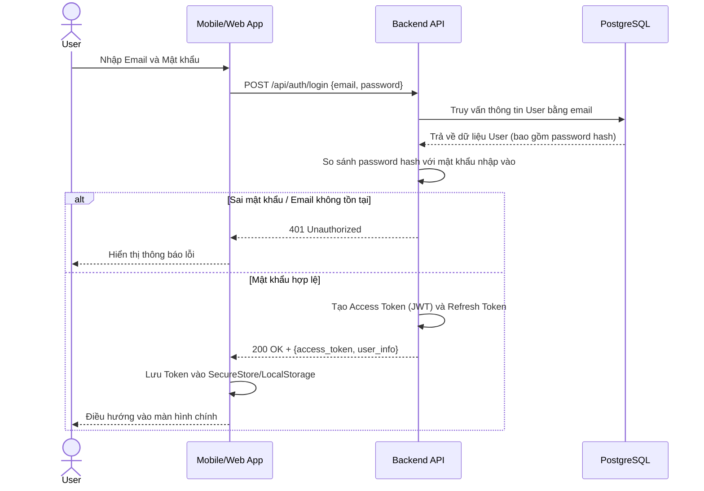
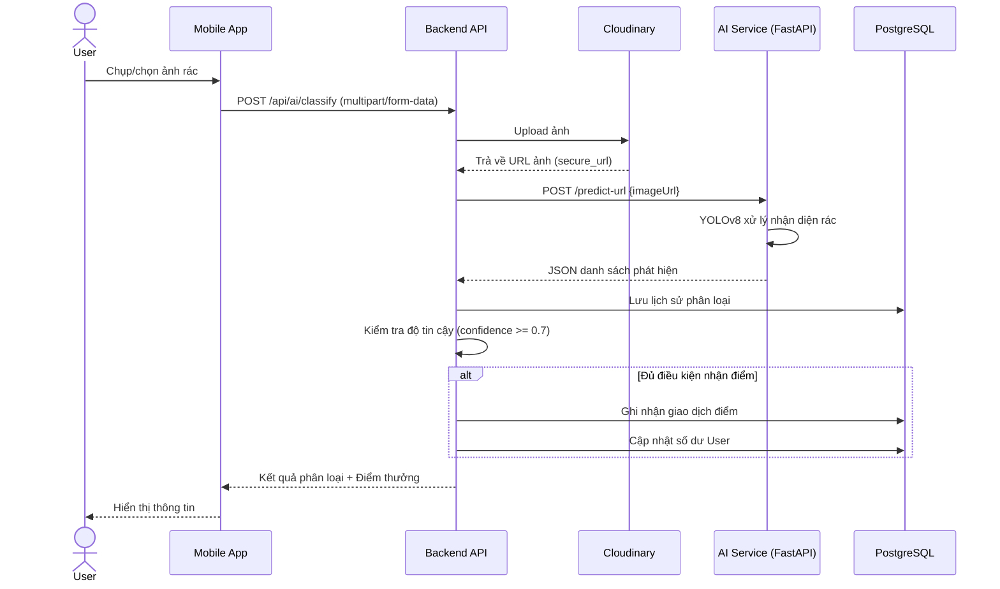
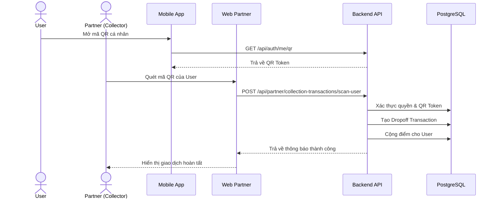
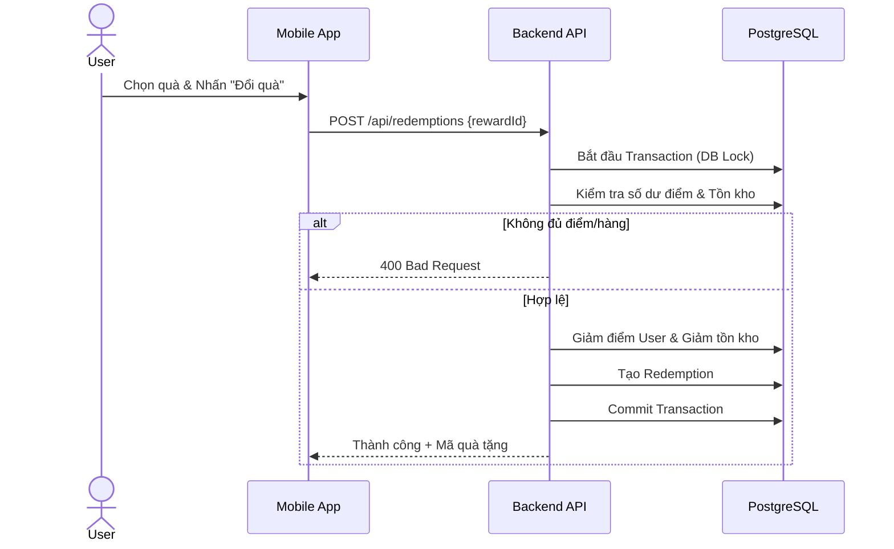
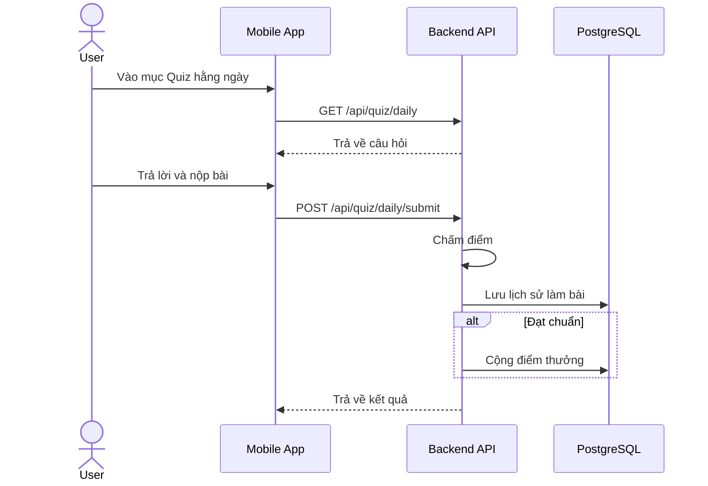
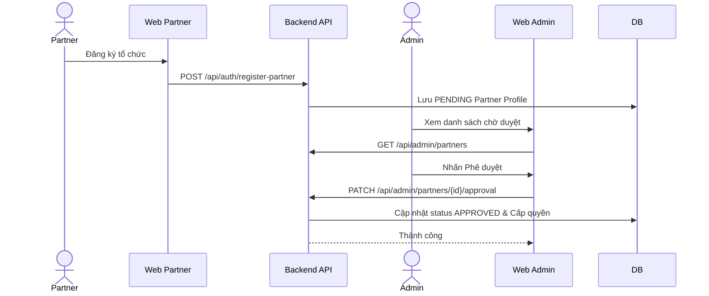

## 4.11 Thiết kế các luồng nghiệp vụ cốt lõi (Sequence Diagrams)

Để làm rõ cách các thành phần hệ thống (Mobile, Web, Backend, AI, Database) tương tác với nhau trong thời gian thực, dưới đây là sơ đồ tuần tự của các luồng nghiệp vụ cốt lõi:

**4.11.1 Luồng Xác thực và Đăng nhập (Authentication)**

**4.11.2 Luồng Phân loại rác bằng AI và Cộng điểm**

**4.11.3 Luồng Giao dịch Thu gom rác (Dropoff Check-in)**

**4.11.4 Luồng Đổi quà (Reward Redemption)**

**4.11.5 Luồng Làm Quiz Hằng ngày**

**4.11.6 Luồng Kiểm duyệt Đối tác**

---

## CHƯƠNG 5: CÀI ĐẶT VÀ TRIỂN KHAI

### 5.1 Môi trường phát triển và công cụ hỗ trợ
- **Môi trường phần cứng:** Máy tính cá nhân (PC/Laptop) với cấu hình tối thiểu RAM 8GB (khuyến nghị 16GB để chạy giả lập Mobile và AI model mượt mà).
- **Hệ điều hành:** Hỗ trợ đa nền tảng (Windows, macOS, Linux).
- **Nền tảng chạy (Runtime):** Node.js v18 trở lên cho Backend/Web, Python 3.10 trở lên cho AI Service.
- **Hệ quản trị Cơ sở dữ liệu:** PostgreSQL v14+ (Lưu trữ dữ liệu quan hệ), Redis v6+ (Lưu trữ bộ nhớ đệm, quản lý phiên).
- **Công cụ lập trình:** Visual Studio Code, DBeaver/PgAdmin (Quản trị DB), Postman (Kiểm thử API).
- **Dịch vụ Đám mây (Cloud Services):** 
  - **Cloudinary:** Dịch vụ lưu trữ và quản lý tài nguyên hình ảnh tối ưu hóa.
  - **Google Gemini API:** Nền tảng AI hỗ trợ sinh nội dung.
  - **Gmail SMTP:** Dịch vụ gửi email tự động (Mã OTP).

### 5.2 Tổ chức mã nguồn hệ thống
Mã nguồn của dự án EcoHabit được tổ chức theo mô hình Monorepo thư mục rời, giúp các thành phần tách biệt nhưng vẫn dễ dàng quản lý chung trong cùng một phiên bản Git. Các thư mục cốt lõi bao gồm:
- `/ai-service`: Mã nguồn Python chứa API nhận diện rác bằng YOLOv8.
- `/backend`: Mã nguồn NestJS RESTful API, trung tâm điều phối dữ liệu.
- `/mobile`: Mã nguồn React Native (Expo) cho ứng dụng di động người dùng.
- `/web`: Mã nguồn React (Vite) cho cổng thông tin quản trị Admin và Partner.

Hệ thống quản lý phiên bản được thực hiện qua **Git** và lưu trữ trên **GitHub**, đảm bảo theo dõi mọi thay đổi trong quá trình phát triển.

### 5.3 Triển khai các dịch vụ phía máy chủ (Server-side)

**5.3.1 Cài đặt Cơ sở dữ liệu**
- Quá trình khởi tạo PostgreSQL và Redis được thực hiện trên môi trường local.
- Database được định hình tự động nhờ TypeORM. Lệnh chạy Migration `npm run migration:run` sẽ tạo các bảng thực tế (Users, Transactions, Rewards...). 
- Script seed data cung cấp dữ liệu giả lập ban đầu để hệ thống có sẵn danh mục phần thưởng và điểm thu gom phục vụ kiểm thử.

**5.3.2 Cấu hình Backend (NestJS)**
- Cài đặt các gói phụ thuộc bằng lệnh `npm install`.
- Thiết lập tệp tin môi trường `.env` chứa các thông số: `DB_HOST`, `JWT_SECRET`, `CLOUDINARY_API_KEY`, `GEMINI_API_KEY`, cấu hình Email SMTP và `AI_SERVICE_URL`.
- Server được khởi động với lệnh `npm run start:dev` và lắng nghe các request tại cổng 3000 (`http://localhost:3000/api`).

**5.3.3 Cấu hình AI Service (FastAPI)**
- Thiết lập môi trường ảo Python (Virtual Environment) và cài đặt thư viện qua lệnh `pip install -r requirements.txt`.
- Nạp trọng số của mô hình nhận diện rác `yolov8n-waste-12cls-best.pt`.
- Dịch vụ được khởi chạy độc lập trên cổng 8000 thông qua lệnh `uvicorn main:app --host 0.0.0.0 --port 8000 --reload`.

### 5.4 Triển khai ứng dụng giao diện (Client-side)

**5.4.1 Nền tảng quản trị Web (Admin/Partner)**
- Ứng dụng quản trị dùng Vite nên thời gian khởi tạo rất nhanh. Sau khi `npm install`, cấu hình file `.env` trỏ tới `VITE_API_URL=http://localhost:3000`.
- Chạy môi trường phát triển qua lệnh `npm run dev` (Cổng mặc định: 5173).
- Khi đưa lên môi trường thực tế, ứng dụng sẽ được build thành các tệp tĩnh (HTML/CSS/JS) bằng lệnh `npm run build`.

**5.4.2 Ứng dụng di động (Mobile App)**
- Ứng dụng được xây dựng trên framework Expo. Cần thay đổi địa chỉ IP của Backend trong mã nguồn Client về địa chỉ mạng LAN thực tế của máy tính phát triển (Ví dụ: `192.168.1.x:3000`) do giả lập/điện thoại nằm trên network khác.
- Lệnh `npx expo start` mở ra DevTools. Quá trình kiểm thử diễn ra bằng cách sử dụng ứng dụng **Expo Go** trên thiết bị iOS/Android để quét mã QR và nạp Bundle Javascript.

### 5.5 Tích hợp các dịch vụ bên thứ ba (Third-party Integrations)
Hệ thống tận dụng sức mạnh của các dịch vụ đám mây uy tín để giảm tải cho máy chủ:
- **Lưu trữ Cloudinary:** Thay vì lưu ảnh rác trực tiếp trong ổ cứng máy chủ gây nguy cơ cạn kiệt dung lượng, hệ thống gọi API Cloudinary để upload ảnh. Ảnh được resize tự động, trả về chuỗi `secure_url` để lưu vào PostgreSQL.
- **Sinh nội dung với Gemini:** Tích hợp mô hình ngôn ngữ lớn (LLM) thông qua API Key của Google. Khi được gọi, Gemini sẽ sinh ra các "Mẹo sống xanh hằng ngày" hoặc bộ câu hỏi Quiz mới một cách linh hoạt, tự nhiên.
- **Xác thực Email (Nodemailer + SMTP):** Sử dụng giao thức SMTP của Gmail để gửi mã OTP khi người dùng đăng ký hoặc quên mật khẩu. Dịch vụ đảm bảo mã OTP chỉ tồn tại và được xác minh trong Redis với thời gian hữu hạn (VD: 5 phút).

### 5.6 Kết quả triển khai và Giao diện thực tế
Dưới đây là mô tả chi tiết và các ảnh chụp minh họa cho các phân hệ của dự án:

**5.6.1 Giao diện người dùng cuối (Mobile App)**
- **Auth & Home:** Màn hình đăng ký có gửi OTP. Trang chủ (Home) hiển thị biểu đồ điểm số thân thiện, thẻ "Mẹo sống xanh" được sinh ra tự động, nút lối tắt vào tính năng chính.
- **Scan AI (Radar & Kết quả):** Trải nghiệm người dùng được tối ưu với hiệu ứng quét sóng Radar khi chờ FastAPI phân tích ảnh. Thẻ kết quả trả về hiển thị loại rác rõ ràng (VD: Nhựa, Thủy tinh), hướng dẫn bỏ rác đúng thùng và pháo hoa chúc mừng nếu được cộng điểm.
- **Bản đồ & Thu gom:** Tích hợp bản đồ hiển thị marker. Khi đến nơi, người dùng mở ví để đưa "Mã QR định danh cá nhân" cho đối tác quét.
- **Đổi quà (Rewards):** Danh sách voucher hấp dẫn, nút đổi quà sẽ xác nhận lại thông qua một Modal và cảnh báo nếu người dùng không đủ điểm.
- **Daily Quiz:** Giao diện câu đố dạng Flashcard, hiển thị câu trả lời đúng/sai ngay lập tức cùng với lý giải.

**5.6.2 Giao diện đối tác (Web Partner)**
- **Dashboard Đối tác:** Tùy thuộc vào quyền (Thu gom rác hay Cung cấp quà) mà đối tác sẽ nhìn thấy chức năng tương ứng.
- **Quản lý điểm thu gom:** Có thể thêm mới địa chỉ cơ sở của mình để hiện lên bản đồ Mobile App.
- **Quét QR Xác nhận:** Giao diện quét mã QR qua webcam/camera máy tính. Khi quét đúng mã QR của User, thông tin giao dịch (số kg, loại rác) hiện lên, đối tác nhấn xác nhận thì điểm sẽ tự động chuyển về ví User.

**5.6.3 Giao diện quản trị (Web Admin)**
- **Dashboard Thống kê:** Hiển thị tổng số User, tổng số rác đã phân loại, tổng điểm đã cấp phát bằng các biểu đồ trực quan.
- **Nhật ký gian lận (Fraud Flags):** Danh sách cảnh báo tự động khi hệ thống phát hiện có hành vi spam quét ảnh AI liên tục nhằm bào điểm.
- **Bảng quy tắc điểm (Point Rules):** Admin có quyền chỉnh sửa cấu hình "Luật chơi" (VD: quét rác đúng = 15đ) mà không cần sửa mã nguồn.
- **Kiểm duyệt AI (AI Review):** Admin xem lại lịch sử phân loại ảnh của User để đánh giá xem AI nhận diện có đúng không, nếu sai có thể gán nhãn lại.
